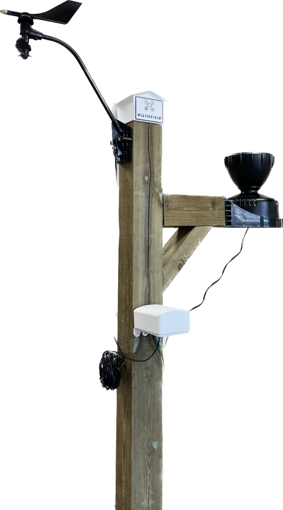

# Abstract

University of Applied Science Novia has had several weather stations throughout the years. Since additive manufacturing and data transfer is getting better and more popular each year, Hans Lindén provided a project to create a new weather station. The goal of this project is to build a low-cost IoT weather station at Novia UAS that is solar-powered and has wireless data transfer to the MQTT broker. Besides that, minimal power should be consumed. The final weather station should be able to measure wind speed, wind direction, temperature, relative humidity and rainfall. As an extra feature, the snow depth and light should be measurable. First, research should be done to reach the goal. After the research, a start will be made on designing and coding. This will lead to the assembling of the weather station with purchased modules. All the relevant information will be documented in a report. Eventually, a look will be given on the final weather station, which will lead to suggested improvements and conclusions. Lastly, the sensors will be changed with cheaper and self-designed versions. Conclusion can be drawn and suggested improvements can be written down. A documentation should be made about the end product. Eventually, the goal of this project was not completely reached. Because of little documentation about NB-IoT, the weather station could not be as energy efficient as possible. Though lots of the aims are reached, such as getting a lower cost version of the weather station and implementing solar power. For the next time for example the additive manufacturing parts should be reprinted for better fitting to improve the weather station.

1.  

# Acknowledgement

We would like to express our great appreciation to thank Hans Lindén for his support in this project as a group counsellor. His help really got us on a good starting path and helped us continue this project. Furthermore, we would like to thank Novia University of Applied Sciences for housing the EPS project here in Vaasa and we want to thank all the teachers for teaching us new things and helping us out. At last, our grateful thanks are extended to each other for being a good team member and giving the support needed.

Table of Content

I. Abstract 1

II. Acknowledgement 2

Table of Content 3

List of Figures 6

List of Tables 8

List of Abbreviations 9

List of Symbols 9

1\. Introduction 10

1.1 European Project Semester 10

1.2 Meet the projectteam 11

1.2.1 Bryan Arents – The Hague, The Netherlands 11

1.2.2 Job van Koeveringe - 's-Hertogenbosch, The Netherlands 12

1.2.3 Chantal Tijhuis – Enschede, The Netherlands 13

1.2.4 Antonin Silvestre – Manosque, France 14

1.3 Team role assessment and allocation 15

1.3.1 Belbin test 15

1.3.3 Leadership test 17

1.4 Projectmanagement 18

1.4.1 Stakeholders 18

1.4.2 Risk management 19

1.4.3 Work breakdown structure 20

1.4.4 Gantt chart 21

2\. Problem statement 23

2.1 Information 23

2.1.1 What? 23

2.1.2 When? 23

2.1.3 Who? 23

2.2 Questions 24

2.2.1 General 24

2.2.2 Sensors 24

2.2.3 Programming 24

2.2.4 Design 24

2.3 Answers 25

2.3.1 General 25

2.3.2 Sensors 31

2.3.3 Programming 33

2.3.4 Design 33

3\. Marketing 34

3.1.1 Logo 34

3.1.2 Poster 36

4\. Project parts 38

4.1 General lay-out 38

4.1.1 Idea phase 38

4.1.2 Concept phase 40

4.1.3 Final phase 44

4.2 Sensors with coding 45

4.2.1 Concept phase 45

4.2.2 Final phase 49

4.3 Design 52

4.3.1 Arduino housing 52

4.3.2 Temperature 56

4.3.3 Wind Speed 59

4.3.4 Wind Direction 62

4.3.5 Rain 66

4.3.6 Solar power 72

4.4 General coding 74

4.4.1 Concept phase 74

4.4.2 Final phase 75

5\. Comparing V1 vs V2 80

5.1.1 Design and accuracy 80

5.1.2 Price 80

6\. Discussion 81

7\. Conclusion 82

7.1 Time spend on the project 82

8\. Recommendations 83

A. References 84

B. Appendices 86

B.1 DIY weather stations 86

B.2 Material choice 86

B.3 Calculations 87

B.3.1 Calculations for the wind direction Design 87

B.4 Specifications 87

B.4.1 Magnetic switch 87

B.4.2 Rotating hall-sensor 88

# List of Figures

Figure 1 Picture of all the Erasmus students of Novia 10

Figure 2 Bryan Arents 11

Figure 3 Job van Koeveringe 12

Figure 4 Chantal Tijhuis 13

Figure 5 Antonin Silvestre 14

Figure 6 Belbin test scores of the members. Orange is Antonin, yellow is Bryan, green is Chantal and brown is Job. 16

Figure 7 Leadership test scores of the members. Orange is Antonin, yellow is Bryan, green is Chantal, brown is Job and gold is a typical project manager. 17

Figure 8 Stakeholders matrix where the stakeholders each have their own number 18

Figure 9 Work Breakdown Structure (WBS) with the phase, each delivery and the tasks 20

Figure 10 Dimensions mounting point 25

Figure 11 Display of professional weather stations 26

Figure 12 Display of amateur weather stations 28

Figure 13 Display of an Arduino MKR NB 1500 31

Figure 14 Closer look on the function of the Arduino with information about each pin 32

Figure 15 Display of the group’s logo 34

Figure 16 Marketing house 35

Figure 17 First poster that has been made for marketing 36

Figure 18 Poster finalization 37

Figure 19 General lay out sketch 38

Figure 20 Mounting station designs 39

Figure 21 Wood used 40

Figure 22 Concrete used 40

Figure 23 Steel used 40

Figure 24 General design 42

Figure 25 Mounting base drawing 43

Figure 26 Mounting base 43

Figure 27 Finalized version of the weather station 44

Figure 28 Sensor AM2320 46

Figure 29 Davis’ anemometer 46

Figure 30 Davis’ rainsensor 48

Figure 31 Temperature sensor 49

Figure 32 Magnetic switch with the magnet 50

Figure 33 Rotating hall sensor 50

Figure 34 Magnetic switch with the magnet 51

Figure 35 Housing for the sensors 52

Figure 36 V1 Arduino housing 53

Figure 37 V2 Top Arduino housing 54

Figure 38 V2 Arduino housing 54

Figure 39 V2 Arduino housing 55

Figure 40 Temperature sensor component 56

Figure 41 Temperature housing top and bottom 56

Figure 42 Temperature sensor housing final version 57

Figure 43 Online found examples of the wind speed design (Grabcad Community, 2022) 59

Figure 44 Self-made design of the wind speed sensor 59

Figure 45 Assemblance of the windspeed sensor to the mounting station 60

Figure 46 Closer look into the sensor part of the design 60

Figure 47 Bearing for the wind speed 61

Figure 48 Different vane design: Falcon and Wingman 62

Figure 49 Wind vane first design and second design 62

Figure 50 Measurements of the second design 63

Figure 51 Centre of Mass distributions of the wind vane with Xr the reference point and Xc the chosen central point 64

Figure 52 Finalized version of the wind direction design 64

Figure 53 New concept for the wind vane 65

Figure 54 The new design of the windvane with the rotation sensor implemented 65

Figure 55 Rain collector funnel 66

Figure 56 Rain collector base 67

Figure 57 Rain collector square 67

Figure 58 Rain collector spoon and support 68

Figure 59 Inside and outside part of the whole rain sensor 68

Figure 60 Rain collector diagram 69

Figure 61 Force distribution on the spoon 70

Figure 62 Magnetic switch draw 71

Figure 64 Housing of the solar panel and its cables 72

Figure 65 Information about the working of the solar panel 73

Figure 66 Picture of the first and second version of the weather station next to each other 80

# List of Tables

Table 1 Belbin team roles with description 15

Table 2 Risk register with information about each individual risk 19

Table 3 List of tasks that needs to be done during the project 21

Table 4 Overview of all the task for the project with the responsible people and the deadline 22

Table 5 Professional examples of weather stations 27

Table 6 Amateur examples of weather stations 29

Table 7 Additive manufacturing filament and their advantages 41

Table 8 Sensors weather station version 1 45

Table 9 Sensors weather station version 2 49

Table 10 Calculations for the estimated weight distribution 63

Table 12 Price difference of the different versions 80

Table Time worked on the project 82

Table 13 DIY YouTube videos given with some information 86

Table 14 Materials and their properties 86

Table 15 Displacements and force of each part 87

Table 16 Specifications of the magnetic switch 87

# List of Abbreviations

| Abbreviation | Definition                        |
|--------------|-----------------------------------|
| EPS          | European Semester Project         |
| UAS          | University of Applied Sciences    |
| IoT          | Internet of Things                |
| NB-IoT       | Narrowband Internet of Things     |
| LTE-M        | Long Term Evolution for Machines  |
| MQTT         | MQ Telemetry Transport            |
| DIY          | Do it yourself                    |
| 3D           | Three-dimensional                 |
| V1           | Version 1                         |
| V2           | Version 2                         |
| PLA          | Polylactic acid                   |
| ASA          | Acrylic styrene acrylonitrile     |
| PETG         | Polyethylene terephthalate glycol |
| UV           | Ultraviolet                       |
| CNC          | Computer Numerical Control        |
| AWS          | Amazon Web Services               |
| I2C          | Inter-Integrated Circuit          |
| CG           | Centre of gravity                 |
| V1           | Version 1 (Weather station)       |
| V2           | Version 2 (Weather station)       |

# List of Symbols

| Symbol (Unit) | Definition                                  | SI                |
|---------------|---------------------------------------------|-------------------|
| Mm            | One thousandth of a meter                   | millimetre        |
| V             | Electrical potential and electrical voltage | voltage           |
| D             | Thickness                                   | meter             |
| M (or m)      | Mass                                        | gram              |
| F             | Force                                       | Newton            |
| mA            | Unit of electric current                    | Ampere            |
| X             | Placement                                   | meter             |
| G             | Gravitation acceleration (9,81 m/s²)        | meter per second² |
| L             | Length                                      | meter             |
| W             | Width                                       | meter             |
| H             | Height                                      | meter             |
| V             | Volume                                      | meter³            |
| S             | Surface area                                | meter²            |

# Introduction

In this chapter information about the EPS, the members and the project can be found. Moreover, the stakeholders, risks and the Gantt chart will be shown.

## European Project Semester

‘European Project Semester (EPS) is a programme offered by several European universities to students who have completed at least two years of study. EPS is created with engineering students in mind, but other students who can participate in an engineering project are also welcome.

EPS is a mixture of “Project Related Courses” and project organized/problem-based learning. It is crafted to address the design requirements of the degree and prepare engineering students with all the necessary skills to face the challenges of today’s world economy. Students work in international and interdisciplinary teams of 3–6 students on their projects. Projects are done in cooperation with commercial businesses and industries or with research centres. There are minor differences between EPS-projects and the various EPS-providers, but all providers have agreed about the following key elements (European Project Semester, 2022).’

This project takes place in Vaasa, Finland. The hosting university is Novia University of Applied Sciences (UAS). This semester, autumn 2022, 5 projects are divided over a group of eighteen students from all over Europe. Mostly Dutch, German, French and Spanish students are partaking. The participating students, plus a few extra Erasmus students, can be seen in Figure 1.

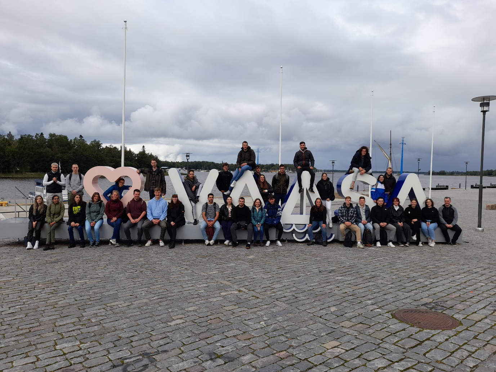

Figure 1 Picture of all the Erasmus students of Novia

## Meet the projectteam

### Bryan Arents – The Hague, The Netherlands

Hello everyone, my name is Bryan Arents. I am from the political capital of The Netherlands, called ‘The Hague’ or in Dutch ‘Den Haag’. My study is also in this city at the ‘The Hague’, University of applied sciences. I studied one year of mechanical engineering and two years of Industrial product design. I am planning to get my bachelor’s in industrial product design, because I really like the broadness of it and I also like the technical creativity combination.

I am 21 years old and my hobbies are fitness, all kinds of extreme sports and gaming. I also like to travel, so that’s also one of the reasons I choose to do this European project semester. For example, I also spend the winter in Bonaire during my gap year, so I lived longer by myself outside the country than actually in my own country.

I wanted to do something outside of the country for my Minor, so I looked up my possibilities. Then I found the European Project Semester. Immediately I knew I wanted to do this. I also wanted a project which would be a little bit more on the technical side. That is where Finland came into the picture. I always wanted to go to the Nordic countries, so this was a good opportunity. Also, I am a big fan of nature and snow, so that also suits my pickings. That’s why I choose to do the EPS in Vaasa.

I think this project fits me well, because my study is literally designing products. So, designing a weather station fits that nice. Also, I have always been interested in following the weather. For example, checking Windfinder for predicting if the surf will be good. Also, I have a bit of experience working with electronics.

My goals with this project are to broaden my knowledge by working with students from different fields. Also, I would like to extend my English communication skills. Furthermore, I would like to develop even more as a product designer.

### Job van Koeveringe - 's-Hertogenbosch, The Netherlands

Hi, my name is Job van Koeveringe. I’m studying at Avans University of Applied Sciences in ‘'s-Hertogenbosch’, colloquially known as ‘Den Bosch’. Currently I’m in my third year of the study Computer Science. The study covers the objects: Applies the principles of mathematics, engineering, and logic to a plethora of functions, including algorithm formulation, software and hardware development, and artificial intelligence.

I am 21 years old, and my hobbies are: Scouting, travelling, home automation and watching Formula 1. Weekly I accompany a group at my own scouting and several times a year for national events of Scouting Nederland. During the holidays, I love to travel with friends and explore the world. In my free time, I love to expand my home automation with open-source software called Home Assistant. On Formula 1 weekends, I am always watching, and I try to visit at least one race a year.

For my Minor, I wanted to do something abroad. I had no interest in just taking classes. My interest was to do something study-oriented in a kind of group assignment. The advisor at my home university recommended me to do a European Project Semester. The question now was where am I going to attend the EPS? My preference was for a northern country. The EPS was offered in Norway and Finland. I had already been on holiday to Norway several times. On the other hand, I had never visited Finland. In Norway, the university was in the middle of Oslo; in Finland, the university was in a student town called Vaasa. After some more comparisons, I finally decided to choose Vaasa Finland.

There were six projects to choose from this semester at the EPS. However, among these, there were only two that fell in my study direction. The submarine and the weather station. The submarine would use a Raspberry Pi and the weather station would use Arduino. Since I already had knowledge of Raspberry Pi, I preferred to do something with Arduino. I also would like to have a physical product at the end of the project and with a submarine there was less chance of that. That's why I went for the IoT weather station.

My goals for this project are to learn to work with foreign students on a joint project, each with their own cultural background, to improve my English communication skills and learn the Swedish language. Also, broaden my knowledge of IoT using AWS.

### Chantal Tijhuis – Enschede, The Netherlands

Hi! I'm Chantal and I am 21 years old. I’m currently in my third year of the study Applied Physics. I am following this study at Saxion, which is located in Enschede. Applied Physics is a broad study. I learned a bit of thermodynamics, fluid mechanics and heat transfer, mechanics, optics, statistics and more. In this team I may not be able to show a lot of study skills, but I will get the chance to learn a bit more about programming and designing.

The hobbies I have outside of school are listening to music, baking, hiking, rollerblading and meeting my friends.

I chose to do the EPS in Vaasa, because I've always wanted to go to a Scandinavian country, which I thought Finland was which is not true, mostly for the differences in seasons. Furthermore, it was a fantastic opportunity. The other option I had is to do the same kind of thing, so a project in a multidisciplinary group, at Saxion or in a different country. Vaasa looked like a nice and not too crowded city, which I really like at the moment. Doing this project outside of my home country can make me learn more about myself, because it is my first time being on my own for a longer period. Furthermore, it is a great opportunity to learn skills from others, not only knowledge, but also social skills.

### Antonin Silvestre – Manosque, France

Hi! My name is Antonin Silvestre. I am 21 years old. I am from Manosque, a small town near Marseille in the south of France. I study at National Engineering school, Tarbes. Currently, I am doing my fourth year of study. My field of study is based on general engineering. I learn mechanical, material science and building engineering.

I applied for the EPS because I really like to work as a team. To me it’s very enriching and it enables me to improve my English. My life is based on challenges and the EPS is a challenge that pushes me out of my comfort zone.

Moreover, EPS is a mix of courses and a project with people from all over Europe. That is perfect to discover new cultures or different way of lives. During my free time I usually do sports, mostly rugby. Furthermore, I like different types of activities that are sport-related, like CrossFit and mountain bike.

Finally, I choose to do my Erasmus in Finland, because I always wanted to travel to a Nordic country for the snow and its landscapes.

## Team role assessment and allocation

### Belbin test

1.  Researcher Meredith Belbin has identified nine types of behaviours within a work environment. Table 1 shows the different kind of behaviours. Most people tend to identify to more than one profile. Prosperous teams consist of a varied combination of behaviours according to Meredith Belbin’s analysis (Belbin, 2022).

Table 1 Belbin team roles with description

|                 | Team Roles            | Contribution                                                                                       | Allowable Weaknesses                                                |
|-----------------|-----------------------|----------------------------------------------------------------------------------------------------|---------------------------------------------------------------------|
| T h i n k i n g | Plant                 | Creative, imaginative, free-thinking. Generates ideas and solves difficult problems.               | Ignores incidentals. Too preoccupied to communicate effectively.    |
|                 | Specialist            | Single-minded, self-starting, dedicated. Provides knowledge and skills in rare supply.             | Contributes only on a narrow front. Dwells on technicalities.       |
|                 | Monitor Evaluator     | Sober, strategic and discerning. Sees all options and judges accurately.                           | Lacks drive and ability to inspire others. Can be overly critical.  |
| A c t i o n     | Shaper                | Challenging, dynamic, thrives on pressure. Has the drive and courage to overcome obstacles.        | Prone to provocation. Offends people’s feelings.                    |
|                 | Implementer           | Practical, reliable, efficient. Turns ideas into actions and organises work that needs to be done. | Somewhat inflexible. Slow to respond to new possibilities.          |
|                 | Complete Finisher     | Painstaking, conscientious, anxious. Searches out errors. Polishes and perfects.                   | Inclined to worry unduly. Reluctant to delegate.                    |
| P e o p l e     | Resource Investigator | Outgoing, enthusiastic, communicative. Explores opportunities and develops contacts.               | Over-optimistic. Loses interest once initial enthusiasm has passed. |
|                 | Coordinator           | Mature, confident, identifies talent. Clarifies goals. Delegates effectively.                      | Can be seen as manipulative. Offloads own share of the work.        |
|                 | Team worker           | Co-operative, perceptive and diplomatic. Listens and averts friction.                              | Indecisive in crunch situations. Avoids confrontation.              |

Figure 6 Belbin test scores of the members. Orange is Antonin, yellow is Bryan, green is Chantal and brown is Job.

With a quick few on the results in Figure 6 it can be said that the members got a lot of roles in common, such as team worker, implementer and coordinator. In the team the roles plant, completer finisher and resource investigator are not prominent. The equal profiles may suggest that little is thought outside the box and that the project will follow one straight line, because the roles not prominent are more creative. Furthermore, equal profiles can mean that sometimes minor frictions can occur. A lot of the members got a higher score on coordinator. With this profile people will mostly lead when needed, which means that if more than one team member takes the lead, discussion may occur. On the contrary, same profiles can complement the group and is essential to achieve an ideal balance for a smooth progress. Moreover, Bryan and Job got shaper and specialist, this means that the group is diverse and well-balanced enough. To make the team more diverse, a resource investigator, a complete finisher, a plant and a monitor evaluator are needed when adding a new team member.

### Leadership test

A person’s strength to manage, lead and guide others is determined with the support of the leadership skills test. Feedback may be given on each team member’s capability to be outstanding leaders (Lavri, 2022).

Figure 7 Leadership test scores of the members. Orange is Antonin, yellow is Bryan, green is Chantal, brown is Job and gold is a typical project manager.

From Figure 7 it can be concluded that none of the team members have reached the scores of a typical project manager on every area. Job scored remarkably high on every area though didn’t reach the score for a typical manager at the area of dealing with uncertainty. Compared to the other team members Chantal did not score high on planning, which means she needs someone who can make the planning for her. Antonin scored a little lower on communication, dealing with uncertainty and creative think’ problem solving. Lastly, Bryan scored the lowest on dealing with uncertainty, which can make him keen on planning everything in detail. The differences in each member’s low scores and each member’s high score may lead to good teamwork. In different situations different members of the team may show off their lead ability. Furthermore, learning from others is increased.

## Projectmanagement

### Stakeholders

A person or group that has an interest in any decision or action of an organization is the definition of a stakeholder (Smith, 2000). In Figure 8 the stakeholder matrix of the project can be seen. The matrix gives a visual overview of each individual stakeholder and their influence and interest. The overview is made more organized by putting in four different quadrants.

1.  Manage Closely: The stakeholder has high influence and high interest
2.  Keep Satisfied: The stakeholder has high influence and low interest
3.  Keep Informed: The stakeholder has low influence and high interest
4.  Monitor: The stakeholder has low influence and low interest

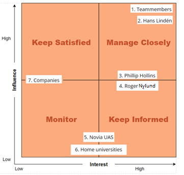

Figure 8 Stakeholders matrix where the stakeholders each have their own number

Established from Figure 8 can be that the group members and Hans Lindén have the most influence and interest in the project. The team members will take care of the project itself and the documentation. Hans Lindén is the supervisor and will provide all the help needed. Philip Hollins and Roger Nylund are placed in the middle of influence and a little bit on the higher side of the interest, because of the influence on the project’s time schedule and documentation. The universities don’t have influence on the project but have a small interest. Looking at the companies, a medium score is given on influence, when looking at the materials, but the interest is low.

### 

### Risk management

All the project risks are marked in the risk register, Table 2. These risks are divided by internal and external project risks. The risks have an impact in the project, which can be prevented by the prevention-management. These risks are marked with the chance and the earnestness. This gives a threat score. The higher the score, the more impactful the risk can be. The highest scores are ranked in red, followed by orange and yellow.

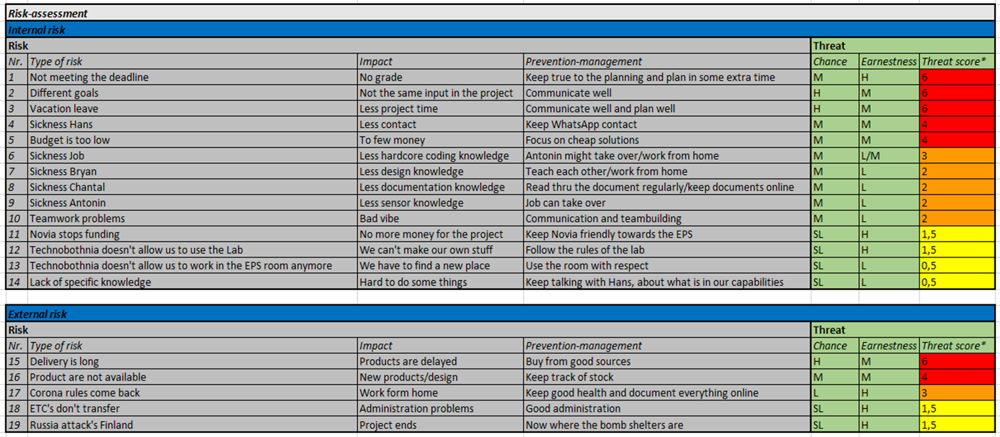

### Work breakdown structure

The Work Breakdown Structure (WBS) is a tool that breaks work into smaller task to make the work more manageable and approachable (WorkBreakdownStructure, 2022). There are two types of WBS: 1) Deliverable-based and 2) Phase-based. In this project the phase-based Work Breakdown Structure is mostly used and can be found in Figure 9.

### Gantt chart

The task list, Table 3, holds all the tasks in the project with the responsible persons, start date, deadline and completion. The tasks are divided into the phases of the project. These phases describe the intricate design phases and help the designer to come to a well-functioning product.

Table 3 List of tasks that needs to be done during the project

| **WBS** | **TASK**                       | **NAME**          | **START**  | **END**    | **DAYS** | **% DONE** | **WORK DAYS** |
|---------|--------------------------------|-------------------|------------|------------|----------|------------|---------------|
| **P1**  | **Analyse phase & Idea phase** | 12-9-2022         | 23-9-2022  | 12         | 100%     | 10         |               |
| 1.1     | Meetings                       | All               | 12-9-2022  | 12-9-2022  | 1        | 100%       | 1             |
| 1.2     | Research                       | Bryan and Chantal | 12-9-2022  | 16-9-2022  | 5        | 100%       | 5             |
| 1.3     | General code                   | Job and Antonin   | 12-9-2022  | 16-9-2022  | 5        | 100%       | 5             |
| 1.4     | Work document                  | All               | 12-9-2022  | 13-9-2022  | 2        | 100%       | 2             |
| 1.5     | Meetings                       | All               | 21-9-2022  | 21-9-2022  | 1        | 100%       | 1             |
| 1.6     | Design                         | Bryan and Job     | 19-9-2022  | 23-9-2022  | 5        | 100%       | 5             |
| 1.7     | Code                           | Job and Antonin   | 19-9-2022  | 23-9-2022  | 5        | 100%       | 5             |
| 1.8     | Documentation                  | Chantal           | 19-9-2022  | 22-9-2022  | 4        | 100%       | 4             |
| **P2**  | **Concept phase**              |                   | 26-9-2022  | 16-10-2022 | 21       |            | 15            |
| 2.1     | Design                         | Bryan             | 26-9-2022  | 7-10-2022  | 12       | 10%        | 10            |
| 2.2     | Production                     | All               | 23-9-2022  | 12-10-2022 | 20       | 40%        | 14            |
| 2.3     | Code                           | Job and Antonin   | 26-9-2022  | 10-10-2022 | 15       | 10%        | 11            |
| 2.4     | Assembling                     | All               | 10-10-2022 | 15-10-2022 | 6        | 0%         | 5             |
| 2.5     | Meetings                       | All               | 27-9-2022  | 27-9-2022  | 1        | 0%         | 1             |
| **P3**  | **Second concept phase**       |                   |  -         |            |          |  -         |               |
| 3.1     | Research                       | All               | 1-11-2022  | 4-11-2022  | 4        | 0%         | 4             |
| 3.2     | Design                         | Bryan (all)       | 1-11-2022  | 20-11-2022 | 20       | 0%         | 14            |
| 3.3     | Code                           | Job and Antonin   | 1-11-2022  | 15-11-2022 | 15       | 0%         | 11            |
| 3.4     | Testing                        | All               | 15-11-2022 | 16-11-2022 | 2        | 0%         | 2             |
| 3.5     | Evaluation                     | All               | 17-11-2022 | 18-11-2022 | 2        | 0%         | 2             |
| **P4**  | **Final phase**                |                   |            |  -         |          |            |  -            |
| 4.1     | Documentation                  | All               | 12-9-2022  | 10-12-2022 | 90       | 30%        | 65            |
| 4.2     | Prototype                      | All               | 12-9-2022  | 10-12-2022 | 90       | 0%         | 65            |
| 4.3     | Presentation                   | All               | 12-12-2022 | 14-12-2022 | 3        | 0%         | 3             |
| 4.4     | Poster                         | All               | 20-11-2022 | 21-11-2022 | 2        | 0%         | 1             |

The Gantt gives an overview of the tasks within the timeline of the project. The start and end day of each task can be seen in Table 4.

Table 4 Overview of all the task for the project with the responsible people and the deadline

# 

# Problem statement

In this chapter the first phase, analyse phase, for the first version of the weather station is described. It contains the problem statement, the first question, the answers on the first question and the design of the logo.

## Information

The first information given is divided in what, when and who to give a clear vision of the project.

### What?

In this project the goal is to build a low-cost IoT weather station at Novia UAS that is solar powered and has wireless data transfer to MQTT broker. Besides that, minimal power should be consumed. Firstly, a working system, prototype, should be made using commercial sensors. The network LTE-M can be used first, but later NB-IoT will be used for more energy efficiency. Furthermore, low-cost sensors should be assessed and with the help of additive manufacturing other sensors the overall cost should be lowered. The code must be made modular so that additional sensors can easily be added and is easy to use.

### When?

The duration of the given project will be from the start of September till the middle of December. The midterm presentation will be held at the end of October. For this presentation a prototype should be finished and most information should be gathered. In the middle of December, the final presentation will be held. It should include the final report, the final version of the weather station and all the other relevant information.

### Who?

The people who will work on the project are Antonin Silvestre, Bryan Arents, Chantal Tijhuis and Job van Koeveringe. The group will be supervised by Hans Lindén. For questions about the European Semester Project Roger Nylund can be approached. Furthermore, the information gathered is for the sake of the school, Novia UAS, and especially for the one leading the project, Hans Lindén.

## Questions

The initial questions asked within the project about the assignment, which will be evaluated through research and practise, may be found in this paragraph. The question will help to get a clearer view on the project and helps with the start-up.

### General

1.  Where should the weather station be mounded?
2.  What kinds of production equipment is available?
3.  Which professional examples are already available?
4.  Which amateur examples are already available?
5.  How to present the data?
6.  How to advertise our project?

### Sensors

1.  What kinds of sensors will we be mounting on version 1?
2.  How to connect all the sensors?
3.  What voltage do the sensors work on?

### Programming

1.  What kind of library’s do we need to use?
2.  What is NB-IoT?

### Design

1.  How to protect the electronics against the outdoor environment?
2.  How to mount the weather station?
3.  How to make the station modular interchangeable?

## Answers

The evaluated questions are answered in this paragraph. It includes the first information of the research. Therefore, answers may change with further research.

### General

#### Where should the weather station be mounded?

The first version of the weather station will be mounted on the top of Technobothnia. There are several options to mount the device. The first option is to mount the device on a lightning distractor tower. This will give a strong and stable mounting point. Figure shows the mounting points with the dimensions of the lightning distractor tower on top of Technobothnia.

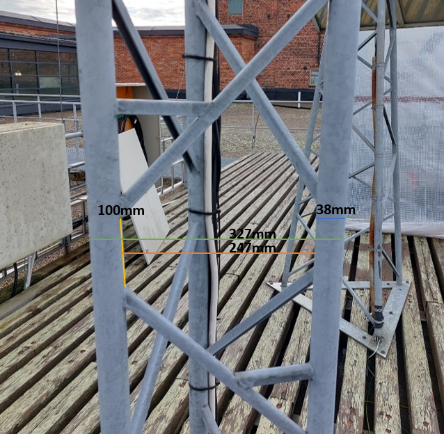  
The pros of this mounting spot would be a level and sturdy mounting place. This mounting place has some cons. For example: The inability to easily move the weather station from Technobothnia to the Novia building. There is also a chance that the mounting spot has different dimensions on the Novia building. This would mean there is a possibility that the second version would have to be a total new design.

The other options are to design a new mounting area. This may solve the cons, but it would mean a little bit more work. Fortunately, there is a lot of time for this project. This will be further investigated in the idea phase.

#### What kinds of production equipment is available?

A lot of equipment is available. The things that are not available are the 3D metal printer, the CNC machine and the robot arms. The other equipment located in Technobothnia are accessible. The materials to work with are wood, plastic and metals. A broad selection of design options is available. The best way to approach choosing the production process is to first look at what is the best for outdoor use. A professional look is wanted as well.

Most of the parts will be 3D-printed, because that is a good option to make intricate designs cheaply. Also, some metal work can come in handy to make sturdy bases.

#### Which professional examples are already available?

Figure 11 shows the searched professional examples of weather stations. It can be seen that most of them are built in similar ways, like SparkFun Electronics (1), Sectron (2) and Weatherspares (4). The one from Meter (3) looks more compact.

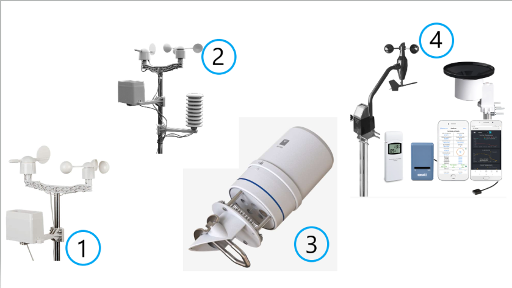

Figure 11 Display of professional weather stations

Table 5 Professional examples of weather stationsTable 5 shows some extra information about the different professional-made weather station. Information about the used materials and the things measured can be found.

Table 5 Professional examples of weather stations

| Nr. | ManufactureR         | Sensors and materials                                                                                                                                                                                                                                                                                                                                      | Measured                                                                                                                                                                       | Source                       |
|-----|----------------------|------------------------------------------------------------------------------------------------------------------------------------------------------------------------------------------------------------------------------------------------------------------------------------------------------------------------------------------------------------|--------------------------------------------------------------------------------------------------------------------------------------------------------------------------------|------------------------------|
| 1   | SparkFun Electronics | wind vane, cup anemometer, tipping bucket rain gauge, two-part mounting mast, rain gauge mounting arm, wind meter mounting bar, mounting clamps and zip ties                                                                                                                                                                                               | wind speed, wind direction and rainfall                                                                                                                                        | (SparkFun Electronics, 2022) |
| 2   | Sectron              | touch LCD with backlight, API, base station (receiver), wind direction sensor, wind speed sensor, rain gauge, USB cable and PC software                                                                                                                                                                                                                    | barometric pressure, outside temperature, indoor temperature, external and internal relative humidity, wind speed and amount of precipitation                                  | (SECTRON, 2020)              |
| 3   | Meter                | pyranometer spectral response compliance, GSA, solar radiation, precipitation, humidity sensor temperature, vapor pressure, barometric pressure, horizontal wind speed, wind gust, wind direction, tilt, lightning strike count, lightning average distance, output, data logger compatibility, connector types, stereo plug connector and conductor gauge | air temperature, relative humility, vapor pressure, barometric pressure, wind speed, gust and direction, solar radiation, precipitation, lightning strike counter and distance | (Metergroup, 2020)           |
| 4   | Weatherspares        | WH57 lightning sensor, WH45 PM2.5/PM10/CO2/temperature and humidity all-in-1 sensor, WH31 multi-channel temperature and humidity sensors, WH51 soil moisture sensors, WH41/WH43 PM2.5 air quality sensors, WH55 water leak sensors and WN34 temp sensors                                                                                                   | anemometer, solar radiation, UV level, light intensity, temperature, humidity, rain, rainfall, windchew, dew point and heat index                                              | (Weatherspares, 2021)        |

#### Which amateur examples are already available?

Figure 12 shows the searched amateur examples of weather stations. These are some of the hand-made examples in DIY-form. The weather station made by S. Agrawal (4) is based on IoT and the one from Open Green Factory (2) is solar based. Those can be useful for this project. Some of the pictures only show the sensor set-up as the end product, those are from C. Barnatt (3) and S. Agrawal (4). U. Winberg (1) has made a design that looks similar to the one of Open Green Factory.

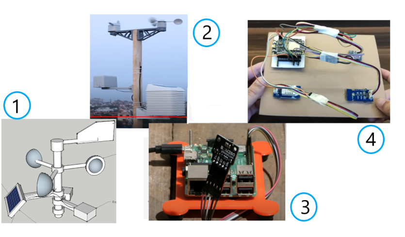

Figure 12 Display of amateur weather stations

Table 6 shows some extra information about the different professional-made weather station. Information about the used materials and the things measured can be found. Only a few home-made examples are listed in the table. More can be found in B. Appendices.

Table 6 Amateur examples of weather stations

| Nr. | Manufacturer        | Sensors and materials                                                                                                                                                                                                                                                                                                                                                                                                                                                                                                                                        | Measured                                                                                                                                  | Source                    |
|-----|---------------------|--------------------------------------------------------------------------------------------------------------------------------------------------------------------------------------------------------------------------------------------------------------------------------------------------------------------------------------------------------------------------------------------------------------------------------------------------------------------------------------------------------------------------------------------------------------|-------------------------------------------------------------------------------------------------------------------------------------------|---------------------------|
| 1   | Ulf Winberg         | push switch, voltage regulator XC6217, resistor 1k;2k;4k;6k, header pin, hall sensor, Bluetooth LE transceiver, Blue low energy device with programmable microcontroller, super capacitor 5F, solar cell, antenna, resistor 1M, capacitor 1u, resistor 2M;100hm;10k;150;300, header pin 2x1;2x10;2x3, CPC102N, CPC1117N, shottky diode CU5520 H3F and temp sensor LM94022                                                                                                                                                                                    | temperature, wind and sun                                                                                                                 | (Winberg, 2015)           |
| 2   | Open Green Factory  | ESP32 Dev Kit V1, TP4056, barometric pressure sensor BME280, temperature sensor - DS18B20, UV index sensor - GY1145, lux level sensor - BH1750, wind & rain sensor, MCP1700-3.3V, resistors - 2 x 1K, 1 x 10K, 3 x 4.7K, 1 x 27K, 1 x 100K, electrolytic capacitor - 1 x 100uF, ceramic capacitors - 4 x 0.1uF, TVS Diode - DT1042-04SO, RJ11 connector, male / female headers, jumper cap, screw terminal-2P - 5.08mm pitch, screw terminal -3P -3.5mm pitch, solar panel - 5V / 1.2Watt, 18650 battery, 8650 battery holder, 22 AWG wires and slide switch | internal temperature, humidity, barometric pressure, external temperature, wind speed, wind direction, rain gauge, UV-index and lux level | (Open Green Energy, 2021) |
| 3   | Christopher Barnatt | Bosch BME280 temperature, pressure, humidity sensor, I2C interface, Qwiic/STEMMA QT connector 3.3V or 5V compatible, reverse polarity protection, Raspberry Pi-compatible pinout, compatible with Arduino, compatible with Raspberry Pi and compatible with Raspberry Pi Pico                                                                                                                                                                                                                                                                                | temperature, pressure and humidity data                                                                                                   | (Barnatt, 2021)           |
| 4   | Saiyam Agrawal      | ESP32 development board, DHT11/21/22 temperature & humidity sensor, SI1145 sunlight sensor, BMP180 barometric pressure sensor, perfboard or breadboard, male to female jumper wires, grove connector cables and micro-USB cable                                                                                                                                                                                                                                                                                                                              | temperature, humidity, barometric pressure UV index IR radiation visible light                                                            | (Agrawal, 2022)           |

#### How to present the data?

The best way to present data is via a website or a mobile app. This will be quickly accessible and not too hard to realise. The data should be in numbers or in letters, but also visible by icons or for example a chart.

#### How to advertise the project?

There are diverse ways to advertise the project. There is at least a requirement to make a poster in A4 format. Furthermore, a website is also an effective way to promote the project and at the same time present the data. There is a screen in Technobothnia where the data can be shown. This would advertise the project by putting in a link and the logo.

### Sensors

#### What kinds of sensors will we be mounting on version 1?

The sensors that will be mounted:

-   Temperature sensor
    -   Temperature sensor FS 400-SHTXX
    -   *Industrial Dustproof Temperature Sensor Stainless Steel Plastic Housing I2C Output FS400-SHT3X*. (z.d.). AliExpress. Checked on 14 September 2022 of <https://www.aliexpress.com/item/4000117617368.html>
-   Wind speed + direction sensor
    -   Davis vantage pro Anemometer
    -   *Davis Vantage Pro2 Anemometer 6410*. (2021, 22 June). Weather Spares. Checked on 14 September 2022 of <https://weatherspares.co.uk/products/davis-vantage-pro2-anemometer-6410?variant=20218104447072>
-   Rainfall sensor
    -   Davis AeroCone® Rain Collector W/Vantage Pro2™ Mounting Base
    -   Khunt, S. (2022, 20 September). *Davis AeroCone® Rain Collector w/Vantage Pro2TM Mounting Base*. Stock4less EU. Checked on 14 September 2022 of <https://stock4less.eu/en-fi/products/6466-dav?variant=43158546940140>

#### How to connect all the sensors?

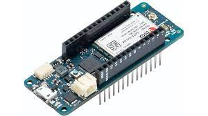

Figure 13 Display of an Arduino MKR NB 1500

The sensors will be connected to the Arduino via male cables. The Arduino used is the MKR NB 1500, see Figure 13. This Arduino allows communication over NB-IoT and LTE-M networks. Communication over these networks will make the weather station excellent for working in remote areas. The connection cable for the sensors still must be bought.

In addition, the following image, Figure 14, shows the pinout diagram to get a better idea of the functionalities of this board.

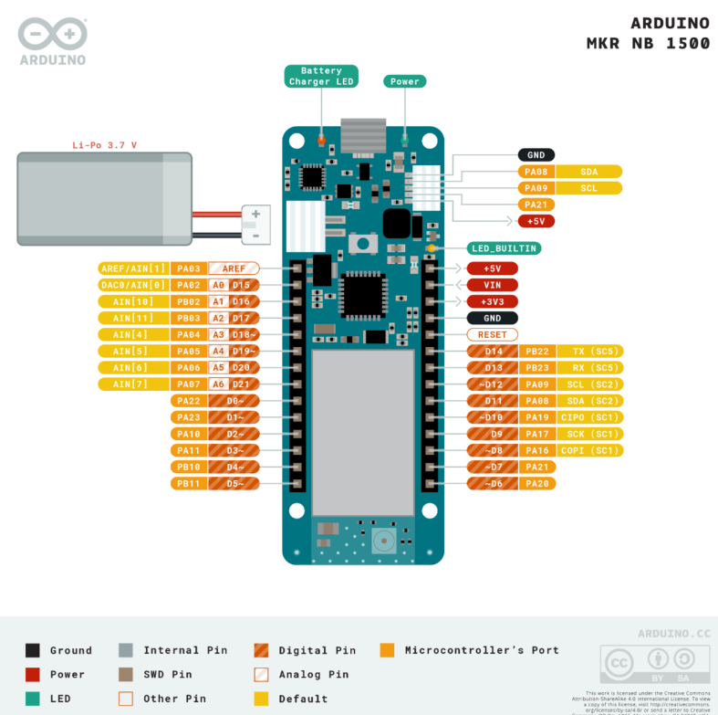

Figure 14 Closer look on the function of the Arduino with information about each pin

This Arduino is perfectly compatible with our goals. All these features make the Arduino MKR NB 1500 board an excellent for many of the basic IoT application scenarios. It is a smart choice for any beginner, maker or professional to get started with Internet of Things (IoT). Its wireless connectivity ability makes this board suitable for use in projects that will communicate with the cloud, such as collecting data from the sensors and uploading this data to cloud services.

#### What voltage do the sensors work on?

The Arduino has a power input by Micro USB (USB-B) with 5V. The Arduino itself runs on the voltage 3.3V. The sensors operate on the Arduino output voltage of 3.3V or 5V. The input voltage for connecting sensors and actuators has a limit 3.3V. Connecting higher voltage signals, like the 5V commonly used with the other Arduino boards, will damage the board.

### Programming

#### What kind of libraries do we need to use?

As an example, for the Arduino the library C++ is used. C++ comes in two pieces: A header file that defines the functionality the library is exposing (offering) to the programs using it and a precompiled binary that contains the implementation of that functionality pre-compiled into machine language (Alex, 2022).

#### What is NB-IoT?

NB-IoT stands for Narrowband Internet of Things protocol using low-power wide area network technology. It is a new technology the enables a wide communication range. This enables the weather station to be used everywhere, wherever there is a mobile network connection.

### Design

#### How to protect the electronics against the outdoor environment?

It is best to choose sensors that are weatherproof, so the weather station can be placed outdoors in all-weather circumstances. The provided sensors are all weatherproof. The Arduino and the connectors are the only things that are needed to be placed inside a waterproof box. The antenna should also be waterproofed. This can be done by using a waterproof kit around the opening of the box for the antenna.

#### How to mount the weather station?

The weather station will be mounted on a moveable station. This will have some tripod feet to stabilize the thing. In the idea phase, more attention will be paid on the mounting station.

#### How to make the station modular interchangeable?

The easiest way to make the station modular interchangeable is to make a mounting station that has a long pole where the sensors can be mounted on. There should be some system to secure and remove the sensors. For example, a hook or a clamp. This will be further investigated during the idea phase.

# Marketing

Everything that involves marketing is placed in this chapter and gives an representative of the team.

### Logo

#### Idea

The logo is found in Figure 15. The logo is designed to give attention to the group name, which is ‘Weathercrew’. The name ‘Weathercrew’ came in mind, because the team is a crew that works on measuring different weather. The logo has a visual attention getter for the things that are important in this project. The visuals stand for the weather that gets measured by the weather station. All the symbols are connected, this is a reference to the weather station being wireless connected to the mobile networks. The colours are all in black, so it will give off a professional look. The logo is surrounded by a rectangle, which brings it all together.

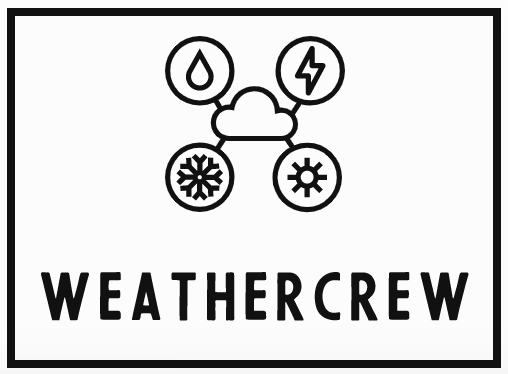

Figure 15 Display of the group’s logo

#### Display

To display the project team responsible, the logo has been put on the top of the weather station with a little house to draw some extra attention. The final design is also made with dual 3D-printing to add different colors for even more pull towards the logo, seen in Figure 16.

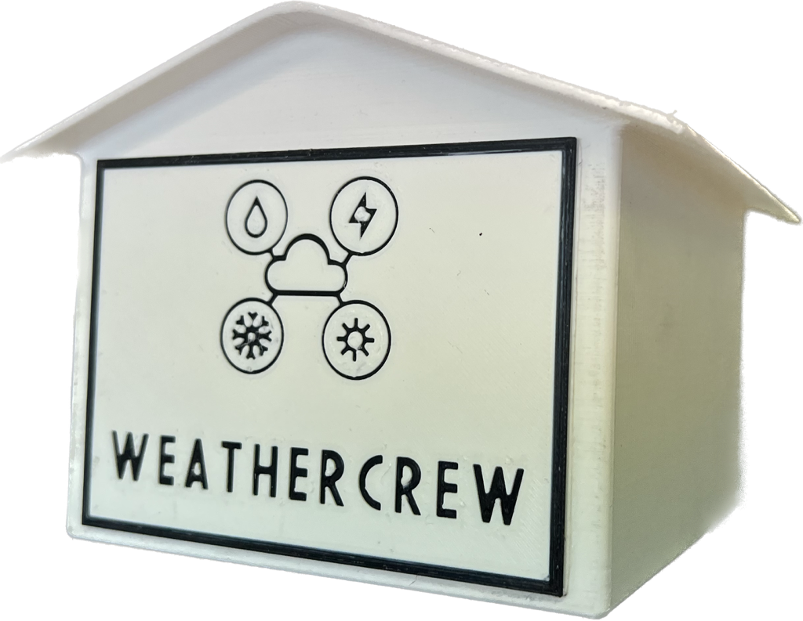

Figure 16 Marketing house

### Poster

#### Idea

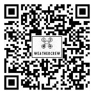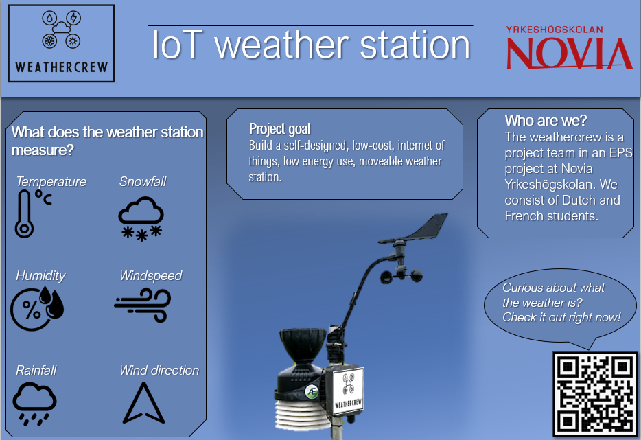A poster is made to show the project to the other students and teachers. In Figure 17 the first version of the poster can be seen. The QR-code to the website works. It contains some information about the measurable parts of the weather station, some information about the team itself and the goal that needs to be reached with the help of the project.

#### Detailing

Figure 18 shows the improved poster. It has the same lay-out at the poster in Figure 17, because the general idea of the layout was approved and liked within the group. The biggest changes are the design of the weather station in the middle of the poster, which has been changed to a more representative version and the parts that will be measured, which have been changed along the way, due to struggles or time restrained.

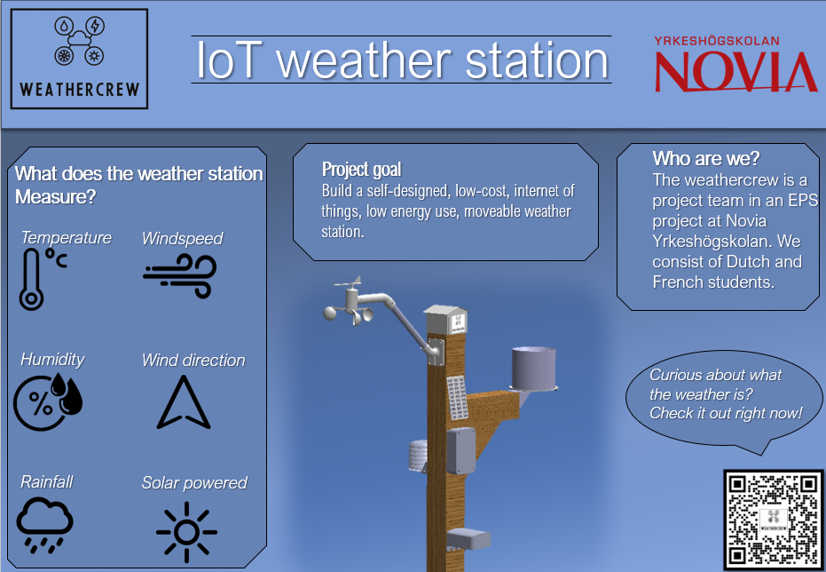

Figure 18 Poster finalization

# Project parts

This chapter contains all the information about the sensors, the design parts and the coding divided in each sensor and part individually.

## General lay-out

### Idea phase

#### Weather station

First thing to figure out is the general lay-out of the weather station. For example, how are the modules going to be mounted and what is on the weather station. In Figure 19 is a sketch of how the general lay-out should look like. Thought has been given on the weight balance and the guideline height standards. The height standards are important for accurate measurement readings. The rain sensor is mounted 200mm sideways form the main pole.

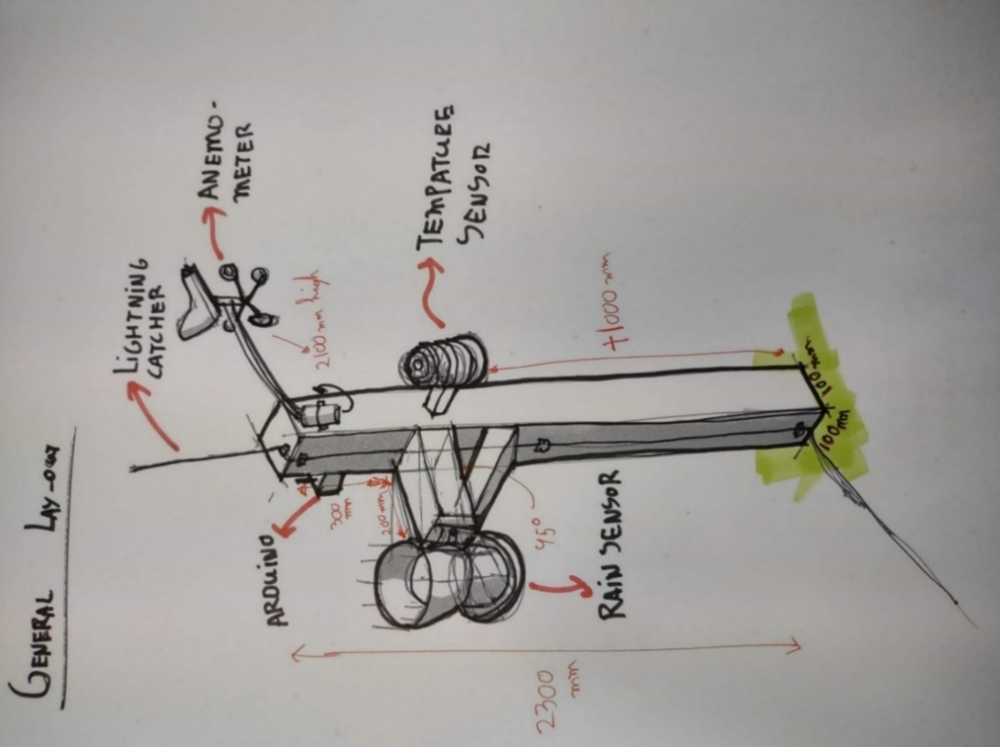

Figure 19 General lay out sketch

By choosing a wooden post for mounting, the modulus is easily interchangeable by screwing or unscrewing the modulus. This solution is fine for the first version and might also be a workable solution for version 2.

#### Mounting station

The design of the mounting station is also required. In the next figure, Figure 20Figure 20, there are some sketches of possible mounting stations. The best ones are worked up with more detailed sketching. Design one has the most advantages, such as that it is a stable structure. This will be the first suggestion to make. Design two is the quick fix, if design two does not work like it should.

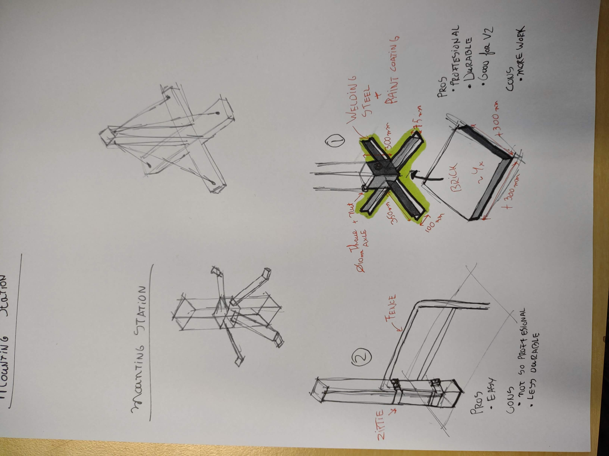

Figure 20 Mounting station designs

### Concept phase

#### Material choice

The mounting station will be the structure that will support the housing for the sensors. Furthermore, it is a structure to mount the rest of the sensors. Extra information about the durability of the materials is given in B. Appendices.

##### Pole

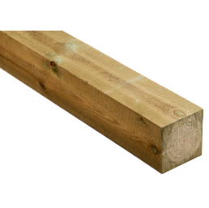The pole will be made of Parru PROF wood that is 100x100mm. The wood is used to support structures that are in contact with earth, water and concrete. It is sustainable, which means that it’s versatile for yard and environmental construction (K-Rauta, 2022). The size of the wooden pole is chosen to be a bit smaller than the designed housing for some extra leeway. *The chosen shape is a square, instead of a circle, because more surface area can be used for the housing and the mounting. Moreover, it is easier to find wooden poles in square shape.*

##### 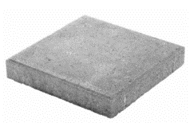Base

For the base Concrete slab grey BL305 300x300x50 offer Varnish (Hartman, 2022). *This concrete may support the pole to stand up straight, because of their weight.* The squares will be put on every side of the pole structure to make an even distribution of weight. To secure the concrete slabs in place, L-shaped steel will be used. This solution can be seen in Figure 20.

##### 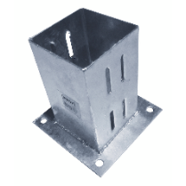Assemble point

A PROF post leg is used to secure the pole and the concrete together (K-Rauta, 2022). The size is 102x102mm and fits the wooden pole perfectly. *It will make the structure stronger and better resistant to the wind.*

#### Additive manufacturing

For additive manufacturing different plastic and materials can be used. A closer look will be given on Polylactic Acid (PLA), Acrylonitrile Butadiene Styrene (ABS), Polyethylene Terephthalate   
Glycol (PETG) and Acrylonitrile Styrene Acrylate (ASA). Table 7 shows the advantages and disadvantages of each material on key features (Flynt, 2020).

Table 7 Additive manufacturing filament and their advantages

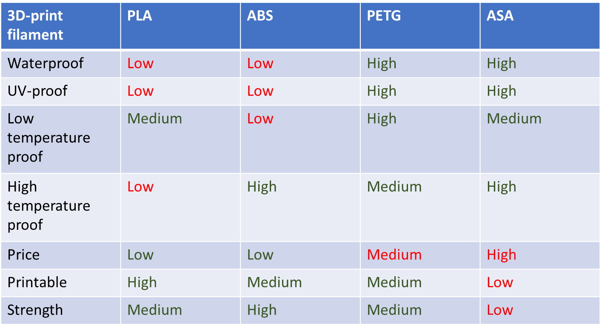

For the first few designs and prototypes PLA will be used. As seen in Table 7 it is low in price and it is easy to print, which shortens the time of the print. Eventually, for the final version of the weather station it is better to use PETG. The weather station will be placed outside and needs to be as weatherproof as possible. PETG scores high on waterproof and UV-proof. Furthermore, it can endure low temperatures. PETG is a bit more expensive than PLA, but the functionality compensates it.

#### Design

##### Weather station

The general design is to be found in Figure 24. The mounting pole is fabricated by woodworking. The sensors are placed with the requirements of the sensors. For example, the windspeed/direction sensor is placed at 2100mm and does not have any wind obstructions. The rainfall sensor is placed 300mm to the side, so there is no obstruction of rain. The Arduino housing is placed at a place that is easy to reach, so this helps with maintainability. The temperature sensor is also easily reachable because there is not a height requirement.

Figure 24 General design

##### Mounting station

The mounting base is important, because if it fails it could break all the sensors. Therefore, the mounting base is built out of metal because it is stronger than wood and has more weight. The mounting base is fabricated with a garden pole mount and four times the 300mm steel L-beams. These L-beams are for stability and to put extra weight in the form of garden tiles. This keeps the weather station on the ground.

It is built by sawing the l-beam into four pieces. Then it’s grinded down and cleaned up. This made it possible to weld the pieces together. After the welding, the entire thing is leveled out by force. After that, it was time to sandblast the entire thing to make it ready for painting. The painting is done in black, because it fits the theme of the weather station very well. In Figure 25 the technical work drawing is to be seen. This was used to fabricate the mounting station.

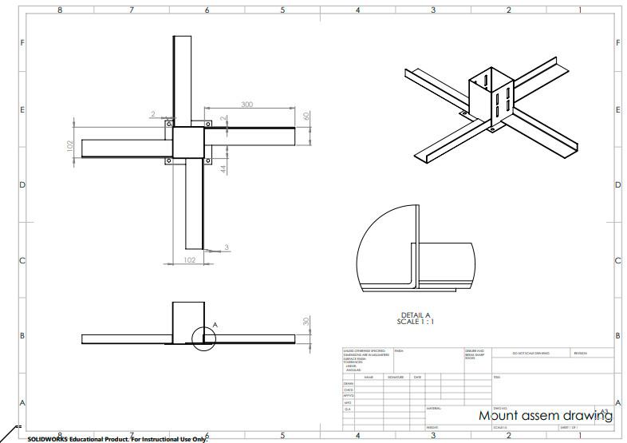

Figure 25 Mounting base drawing

The sketch and design of the mounting station can be found in Figure 25 and the fabricated piece looks like Figure 26.

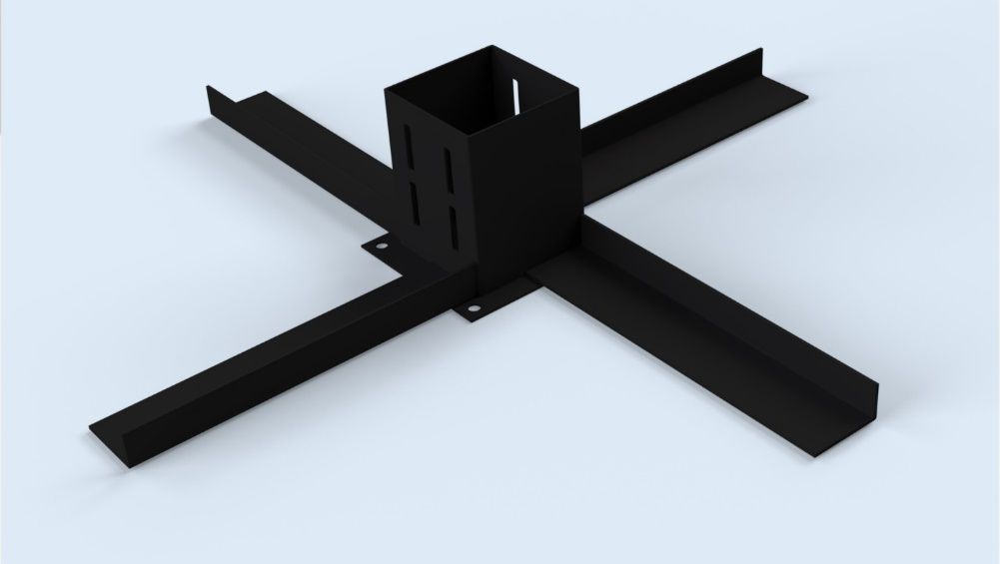

Figure 26 Mounting base

### Final phase

#### Weather station

The lay-out of the weather station has been changed a little, Figure 27. For the final version the ready-to-use sensors have been swapped with self-made versions. In addition, a solar panel has been added. The general lay-out, like the pole and mounting base, will stay the same, because it is strong enough, movable and easy to change.

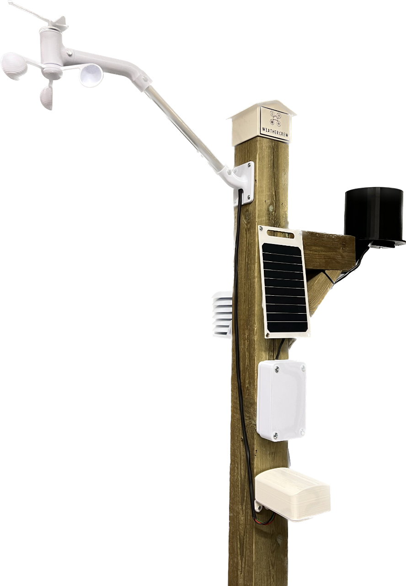

Figure 27 Finalized version of the weather station

#### Mounting station

The mounting station is tested and it works well. It is quite a stable structure. This is the reason that no big improvements are necessary for the final design. The mounting station shown in Figure 26 is continued to be used for the final design of the weather station.

## Sensors with coding

### Concept phase

#### Sensor type and price

Ready to use sensors will be used to get a working weather station, which will be the default, shown in Table 8. This station needs to contain sensors for wind speed, wind direction, temperature, relative humidity and rain.

Table 8 Sensors weather station version 1

| Name                                                    | Sensor                          | Source                                                                                            | PRice |
|---------------------------------------------------------|---------------------------------|---------------------------------------------------------------------------------------------------|-------|
| AM2320 Digital Temperature and Humidity Sensor          | Temperature / Relative humidity | https://shop.pimoroni.com/products/digital-temperature-and-humidity-sensor?variant=35611648138    | €4    |
| Anemometer for Vantage Pro2™ & EnviroMonitor            | Wind speed / Wind direction     | https://www.davisinstruments.com/products/anemometer-for-vantage-pro2-vantage-pro                 | €185  |
| AeroCone Rain Collector with Vantage Pro2 Mounting Base | Rain                            | https://www.davisinstruments.com/products/aerocone-rain-collector-with-vantage-pro2-mounting-base | €120  |

##### Reasoning use

Most of the sensors used in the first version were already present or being shipped to the school. Using them saved time and it gave a starting point. Furthermore, when the sensors work, they can already read in some data, which gives data for comparison.

#### Specification sensor and code

##### 4.2.1.2.1 Temperature

###### Sensor

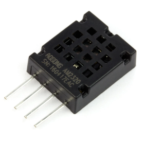The first sensor used is AM2320, Figure 28, which measures temperature and humidity. The initial thought was to use the sensor, which is used for the second version, FS400-SHT3X, but it was not functioning properly. This leaded to the use of the cheapest temperature sensor. The humidity accuracy is 3% and the temperature has an accuracy of 0.5°C. In addition, the range of degrees Celsius is from -40 to 80.

###### Code

Reads digital data by protocol I2C from the AM2320 sensor.

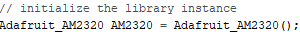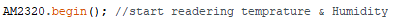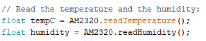

##### 4.2.1.2.2 Wind Speed & Wind Direction

###### 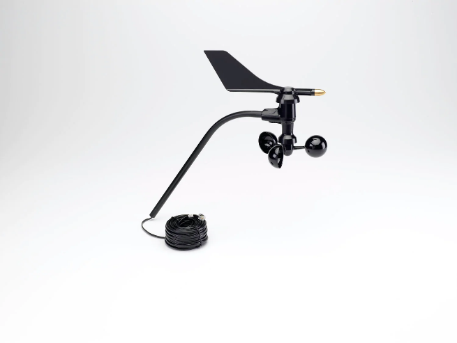Sensor

The anemometer sensor, shown in Figure 29, is from Davis' products and it can operate within the temperature range of -40°C to 65°C. The sensor measures wind direction and wind speed. The range of speed for the sensor is 0 km/h to 322 km/h with an accuracy of 3 km/h. The wind direction is measured in 16 points with 22,5° each and it has an accuracy of 2°.

###### Code Wind Speed

Register WindSensorSpeedPin and attach interrupt:

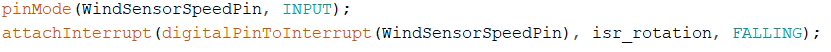

Add one rotation when there is a full rotation:

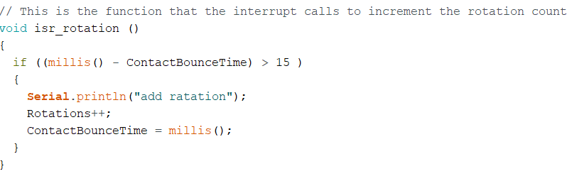

Calculate wind speed for miles and kilometre per hour:

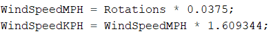

Reset rotations after calculating speed:

###### Code Wind direction

Reads analog data with a value from 0 to 1023 and converts it to rang of 0 to 360.  
If the wind direction has an offset, it will be added.

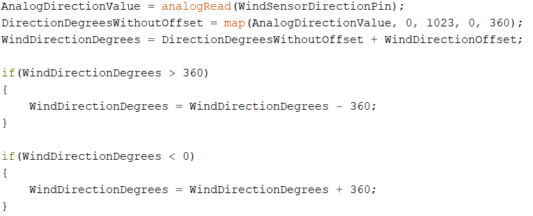

##### 4.2.1.2.3 Rain

###### 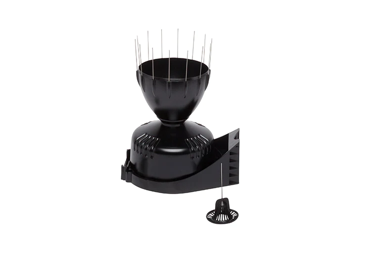Sensor

The rain sensor is from Davis’ instruments, Figure 30. This sensor works with a tipping spoon. The rain falls into the bucket, which has an area of 214 cm, and flows into the spoon. When the amount of rain is sufficient, it makes the spoon tip. Water flows out of the spoon into the holes and the spoon rises again by the counterweight. The magnetic switch is triggered and sends the data to the Arduino. Each scale represents 0.2 mm of rain. The accuracy for the rain rate is around 5% which rates up to 250mm/hr and the accuracy for the rainfall is around 3% or 0.2mm.

###### Code

Register RainSensorPin and attach interrupt:

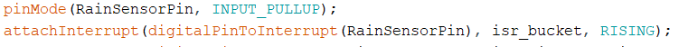

Add bucket amount to hourly and daily rain value when the bucket tips:

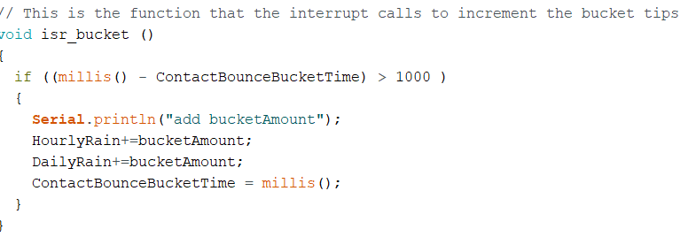

Reset the hourly and daily rain value:

### Final phase

#### 4.2.2.1 Sensor type and price

Changes are made to the default weather station. The ready to use sensors are replaced with low-cost sensors and the designs are made with additive manufacturing. Table 9 shows the sensors with the supporting parts, like magnets, and their information and prices.

Table 9 Sensors weather station version 2

| Name                                 | Sensor                          | Source                                                                                                                   | PRice   |
|--------------------------------------|---------------------------------|--------------------------------------------------------------------------------------------------------------------------|---------|
| KA-80 Reed magnet switch with magnet | Wind speed                      | <https://www.starelec.fi/product_info.php?products_id=30031> <https://www.starelec.fi/product_info.php?products_id=7470> | €3+€1   |
| MXH2019-0304-01 Draaibare halssensor | Wind direction                  | <https://www.amazon.de/gp/product/B07PFD816C/ref=ppx_yo_dt_b_asin_title_o00_s00?ie=UTF8&psc=1>                           | €33     |
| Temperature sensor FS 400-SHTXX      | Temperature / Relative humidity | <https://www.amazon.com/Dustproof-FS400-SHT3X-Temperature-Humidity-Stainless/dp/B07WV924M8>                              | €12     |
| KA-80 Reed-magnet Switch With magnet | Rain                            | <https://www.starelec.fi/product_info.php?products_id=30031> <https://www.starelec.fi/product_info.php?products_id=7461> | €3+€0,5 |

##### Reasoning change

To achieve the projects goals a look is given into cheaper sensors with similar mechanism and type of coding. The bigger sensors, like the Davis’ anemometer, are on the expensive side and can be made cheaper with the change to cheaper sensors and the help of additive manufacturing. It can be seen that a more expensive temperature sensor is used. The reasons for this are a higher accuracy of the measurements, better airflow and a possibility for a better design for the housing.

#### Specification sensor and code

##### 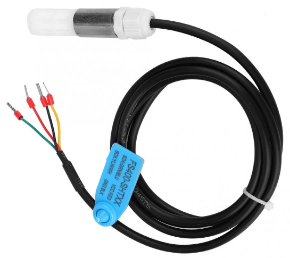Temperature

###### Sensor

The FS 400-SHTXX can be found in Figure 31. The temperature range is between -20°C and 100°C and the humidity range is between 0% and 100%. It has high accuracy, but with long-term exposure to outside conditions, especially to humidity above 80%, a temporary signal drift can take place.

###### Code

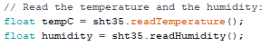

##### Wind Speed & Wind Direction

###### Sensor

For the wind speed the magnetic switch is used Figure 32. The switch is a KA-80 and can withstand temperatures from -55 to 125°C. It switched on and off with the use of the magnet. The number of rotations in a timestamp can be determined. This gives the rotation speed.

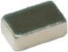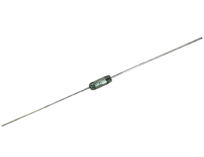

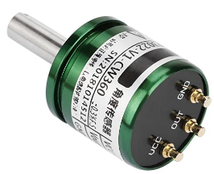Figure 32 Magnetic switch with the magnet

Figure 33 shows a rotating hall sensor. It measures from 0 tot 360° with a 0.088° resolution. This sensor is used for the wind direction. The degrees can be renamed into directions, such as north and south.

###### Code Wind Speed

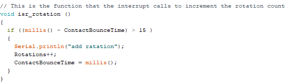

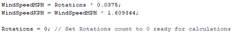

###### Code Wind Direction

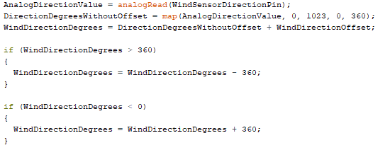

##### Rain

###### Sensor

For the rain sensor the magnetic switch used is a KA-80, Figure 34. The switch can withstand temperatures from -55 to 125°C. It switched on and off with the use of the magnet, which can show the number of times the tipping spoon has tipped over.

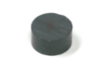

Figure 34 Magnetic switch with the magnet

###### Code

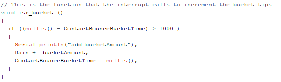

After sending data the rain will be set to 0.

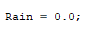

## Design

### Arduino housing

#### Idea

##### Version 1

A weatherproof housing is required to keep the Arduino battery and the antenna safe. In Figure 35 it is shown how the housing for the sensors is designed. 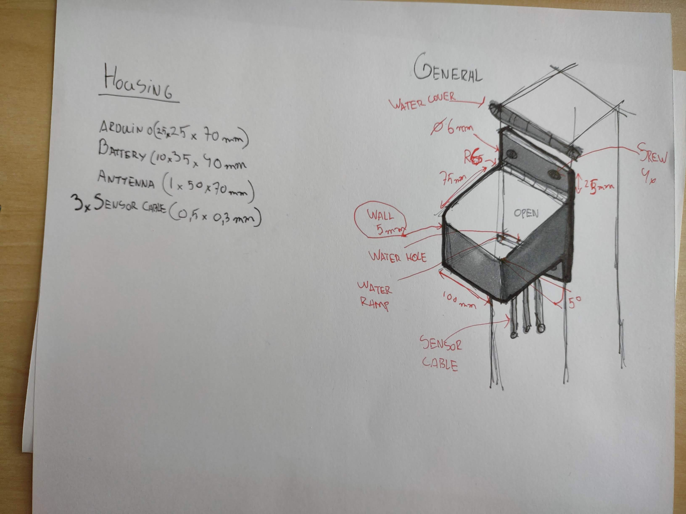

Figure 35 Housing for the sensors

#### 4.3.1.2 Concept

##### Version 1

The Arduino housing is to keep the Arduino, connectors, antenna and battery far away from the elements. This is done by mounting the housing directly to the wooden pole with a rubber seal in between. Any condensation that still could come in rolls down to the cable opening, because there is a 5-degree slope on the design. After discussion, it was decided not to use this design, because it would mean the hole housing had to be unscrewed to access the Arduino. In the next design the top should be easily removable. The first version is to be seen in Figure 36.

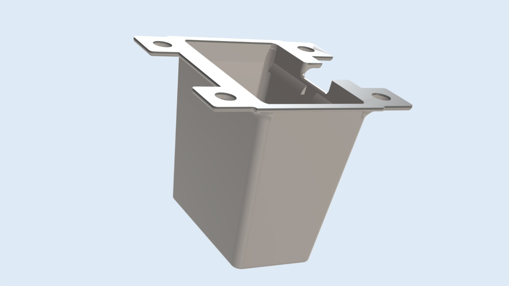

Figure 36 V1 Arduino housing

##### Version 2

The second version should have a removable top to access the components. The version 2 is printed in horizontal orientation, this insures a good texture on the inside of the part. This also helps with a nice finish on the outside of the part. Only the underside will be a little rough. The print variables are the regular settings. The print is 150 grams of PETG, so that’s about €6,50. There are some extra improvements to the housing, such as a thinner wall as a place for the antenna. The top is to be found in Figure 37 and the bottom is to be found in Figure 38.

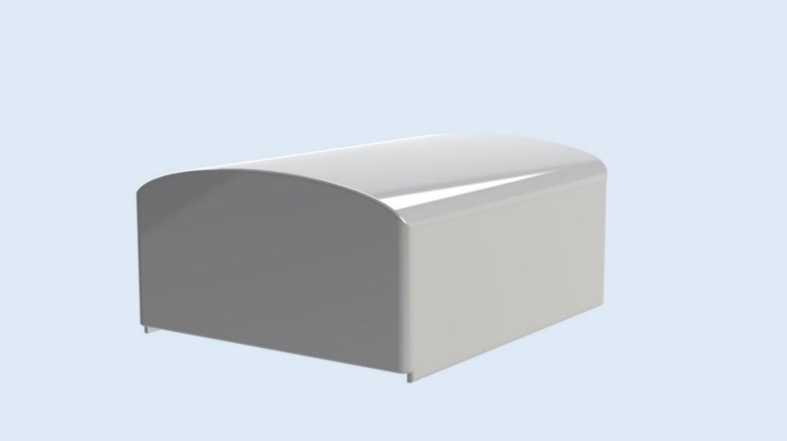

Figure 37 V2 Top Arduino housing

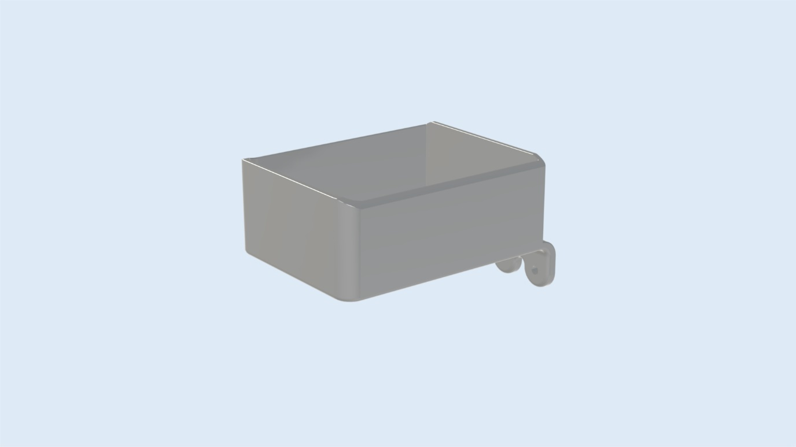

Figure 38 V2 Arduino housing

In Figure 39 the design of the inside of the Arduino housing is explained. All the components are lifted, so condensation will not touch the components.

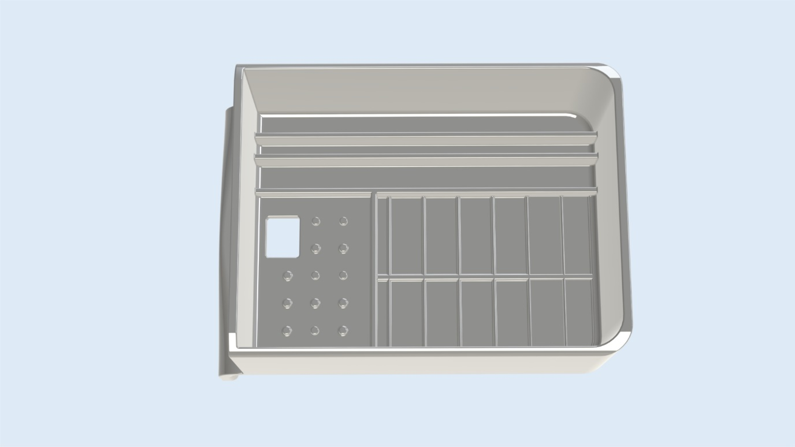

Figure 39 V2 Arduino housing

### Temperature

#### Idea & Concept

#### Housing version 1

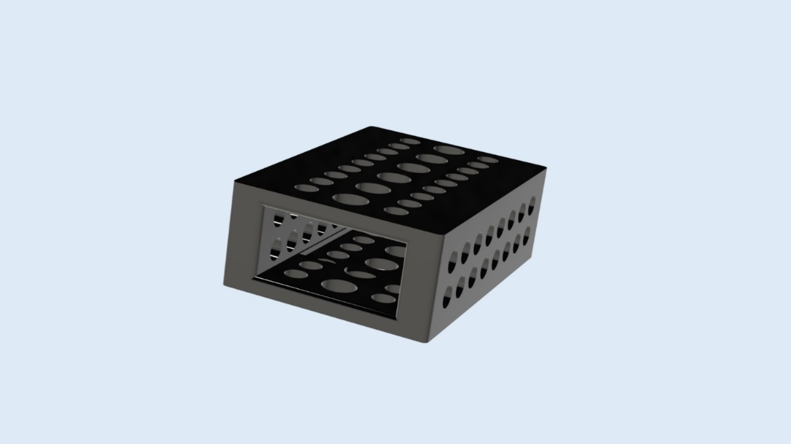

Figure 40 Temperature sensor component

The sensor that will be used for the temperature and humidity is small and not weatherproof. This means that it should be protected against the elements, but there should also be free airflow to the sensor for it to be accurate. This makes it a little hard. Therefore, the sensors are first placed inside the component from Figure 40. This has many holes so there is free airflow and it can be mounted to the top of the housing design from Figure 41. The top of the housing design also has airflow openings. This product is glued to the bottom housing. This part of the housing also has some openings, but these are for letting out any snow/rain inside of the housing. The bottom part of the housing is used to mount the entire product to the pole. The part is printed in horizontal orientation, this insures the best strength and the nicest finish. The print variables are the regular settings. The print is 60 grams of PLA, so that’s about €1,50.

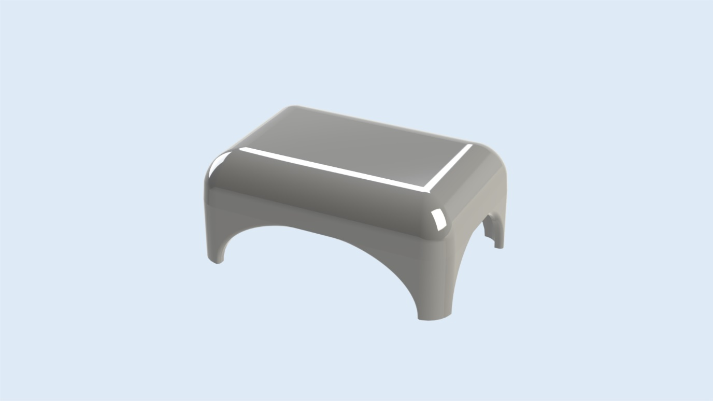

#### Final design

##### Design

The final design is focused on making the bought sensor work correctly. This sensor is waterproof, so it is much better for the weather station than the first one. The sensor is glued inside the center of the base part. The cable runs down the middle and is zip tied to the part. The base part is screwed to the wooden pole. The disks are stacked onto each other leaving little room for airflow whilst still protecting against the sun, so the sensor doesn’t heat up extra. The part is printed with 200gr PETG, this is about €8,70. The parts are found in Figure 42.

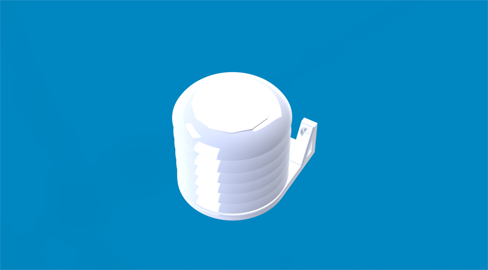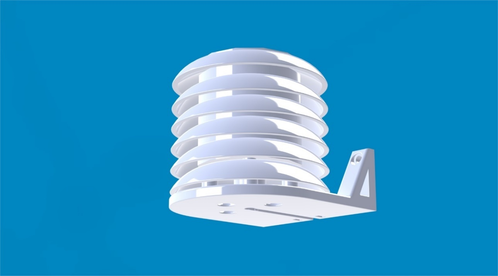

##### How does it work

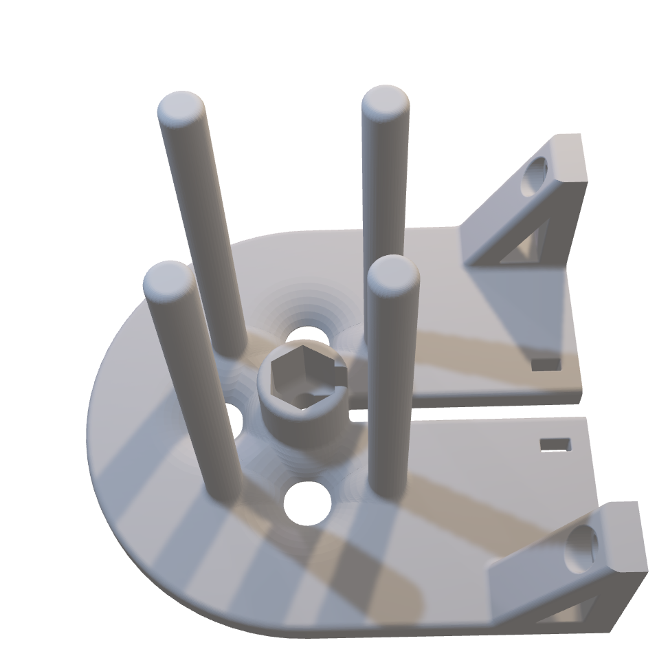The sensor found in Figure 35 has a temperature range of -60 to 80 degrees Celsius and measures 0 to 100% humidity. These ranges are good for the environment here in Vaasa. The sensor is glued inside the middle of the part found in Figure 6. The part has some waterflow holes to stop water and snow filling the part.

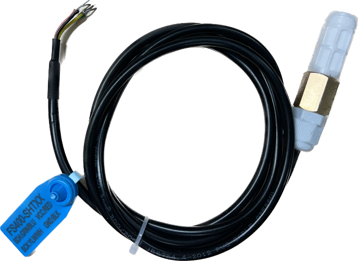

Figure 35 Used temperature sensor

### Wind Speed

#### Idea & Concept

Looking into already build concepts, seen in Figure 43, the idea is to give the wind speed design half of a sphere shape to catch the wind. Three of them should be utilized and put into a circle with even spacing.

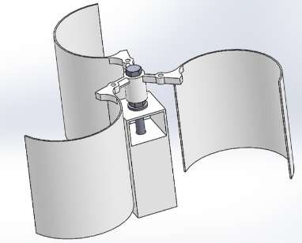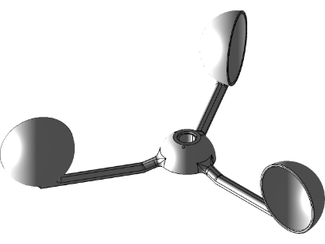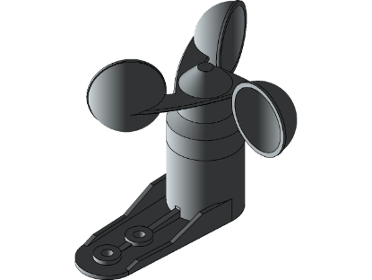

Figure 43 Online found examples of the wind speed design (Grabcad Community, 2022)

All the designs are made with the airflow in mind, which means each side with half of the sphere should not interrupt much of the airflow blown over the following sphere shape. The concept of the design is shown in Figure 44.

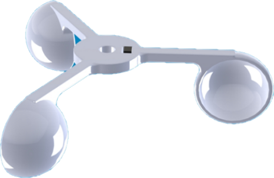

Figure 44 Self-made design of the wind speed sensor

#### Final design

##### Design

The windspeed sensor is mounted to an arm with similar dimensions to the Davis wind sensor. This insures a steady airflow to the windspeed and wind direction sensor. Those two sensors are mounted. The arm is partially 3D-printed and partially made out of aluminium tubing. These are bolted together with screws. These materials were chosen, because they do not corrode and are light weight. The design is focused on strength, printability and accuracy. The design is found in Figure 45.

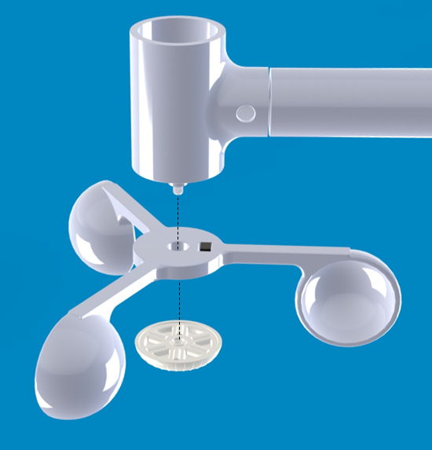

Figure 45 Assemblance of the windspeed sensor to the mounting station

##### How does it work

The wind speed sensor works by a magnetic switch and a magnet, shown in Figure 46. The magnet is glued on the cup wheel. The magnetic switch is glued in the arm. Every time the wheel turns the magnetic switch notices the magnet and sends a signal. This signal goes to the Arduino.

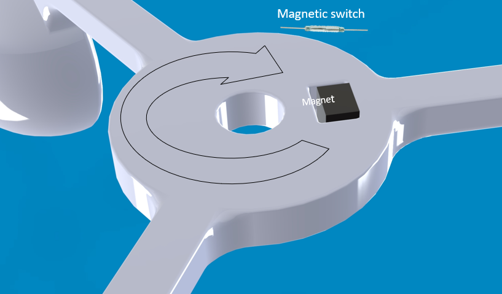

Figure 46 Closer look into the sensor part of the design

To ensure minimal resistance to the wheel a special bearing is designed, Figure 47. The bearing cap has horizontal roller, which supports the wheel, yet minimalizes resistance. This insures the most accurate measurements possible.

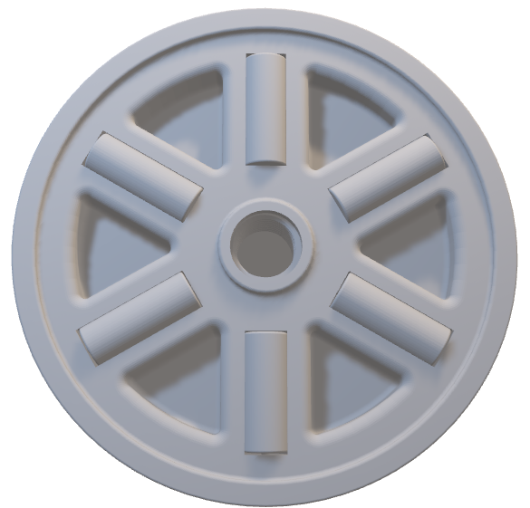

Figure 47 Bearing for the wind speed

### Wind Direction

#### Idea

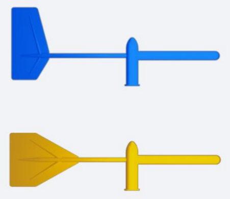The wind vane should have an optimal shape to turn in the wind. A look has been given on different studies. The Falcon and Wingman, seen in Figure 48, are great optimized designs compared to a rectangular vane (Sammarco, 2019). The Falcon is the ones that will be recreated for this project, because of the improvement in response time. It is improved because of a higher aspect ratio and its raised surface (Hugo Kerhascoët, 2016).

The wind direction sensor will be made with the use of additive manufacturing. Plastic will be the material used. This means that the back is heavier than the front. A metal point will be put in the front to balance the vane on a chosen central point.

#### Concept

 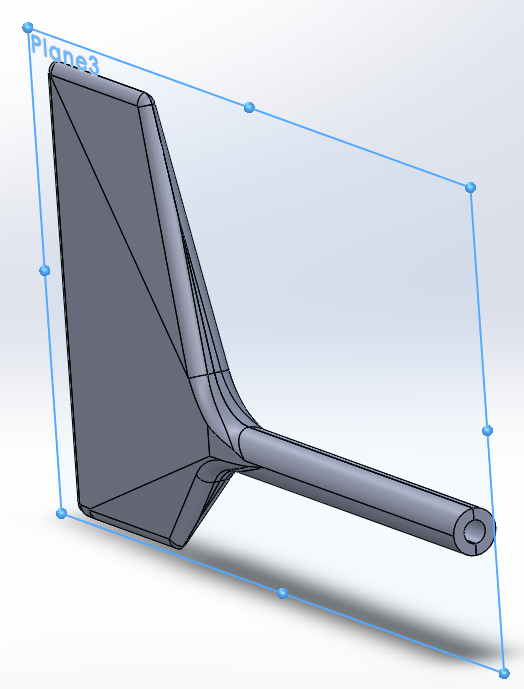

Figure 49 Wind vane first design and second design

Figure 49 shows the designs made for the wind vane. The first and second design have been made in the same way. The main difference is the thickness of the vane. Version two has been made thinner to improve lightness and therefore its ability to spin.

##### Calculations center point

For the calculations of the weight distribution of the second designed vane the sketch, seen in Figure 50, is divided in three parts. The measurements are given, and the depth of the vane is between 5 and 15 mm. The volume given by Solidworks is 120234.44 mm². With the help of the calculations the volume of each part will be estimated. PLA is used, which gives a weight of 86 g of the windvane according to the Ultimaker Cura. 86 g of PLA is around €3,75. The calculations can be found in Table 9Table 10.

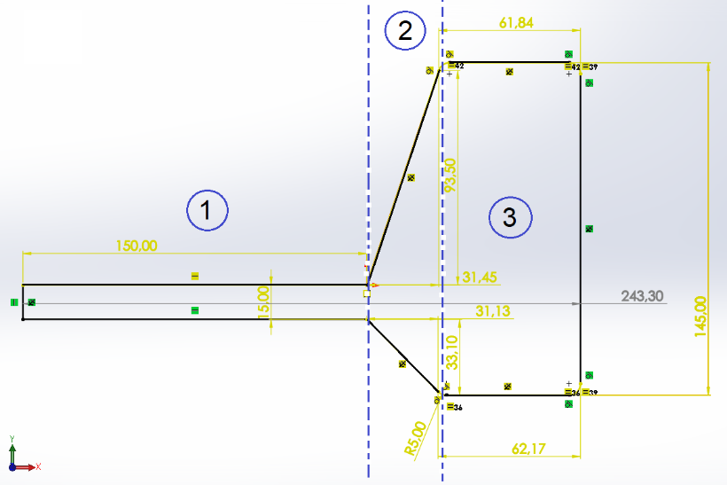

Figure 50 Measurements of the second design

Table 10 Calculations for the estimated weight distribution

| **Part (nr.)** | **Volume (mm²)** | **Percent (%)** | **Weight (g)** |
|----------------|------------------|-----------------|----------------|
| Part 1         |                  | 5,92%           | 5,1 g          |
| Part 2         |                  | 28,36%          | 24,4 g         |
|                |                  |                 |                |
|                |                  |                 |                |
| Part 3         |                  | 65,72%          | 56,5 g         |
| Total          |                  | 100,00%         | 86 g           |

It shows that part 1, 2 and 3 weight 5.1, 24.4 and 56.5 g. Using the equation for the center of mass, Equation 1, a calculation can be done to find the weight of the metal. In addition, Equation 2 is used to calculate the shift of the center of mass.

Equation 1 Centre of Mass (Finn, 2017)

Equation 2 Newton’s law (Hall, 2022)

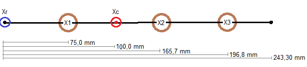

Figure 51 Centre of Mass distributions of the wind vane with Xr the reference point and Xc the chosen central point

Figure 51 shows the center of mass distribution of the wind vane. The placement of the center of mass is at 100,0 mm. Calculations, given in B.3 Calculations, give a mass of 69,45 g at the reference point, where the metal will be placed.

#### Final design

In Figure 52 the finalized design of the wind vane made with plastic and metal is found. Despite the calculations made, it was found that the centre of gravity is not in the right place. This may be due to the wrong placement of the white support. Therefore, the choice was made to design a new vane, Figure 53.

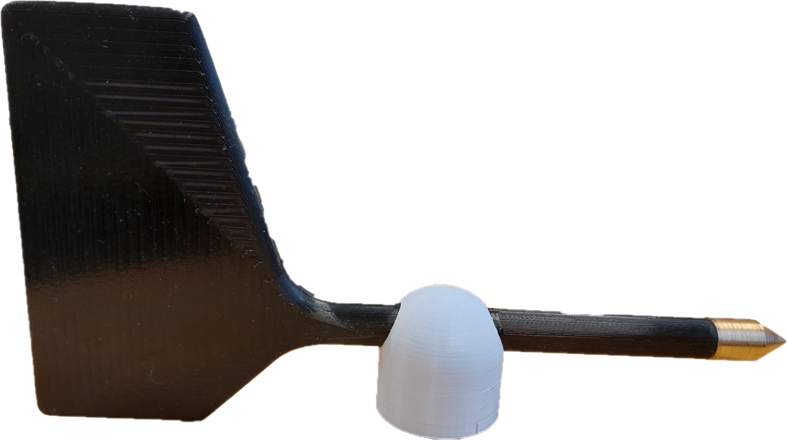

Figure 52 Finalized version of the wind direction design

##### Design

Due to the centre of gravity in the wrong place and a high weight, the wind vane will preferably tilt to one side, which will make the vane spin faster or slower depending on the direction. Another design was created with only PETG, where the focus was put on getting the right place for the centre point. A small version was printed out and can be seen in Figure 53.

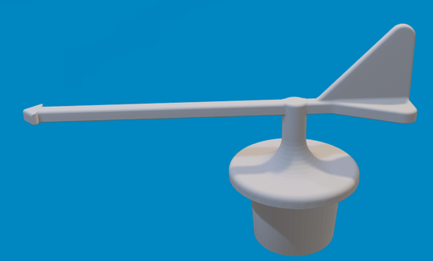

Figure 53 New concept for the wind vane

##### How does it work

The analog ration sensor, Figure 54, measures the degrees the wind vane turns. This can be translated into the common ways to display wind direction like N, E, W and S or NE, SE, SW, NW.

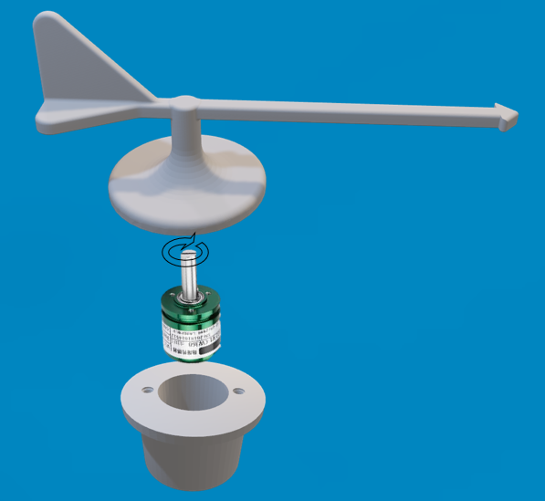

Figure 54 The new design of the windvane with the rotation sensor implemented

### Rain

Concerning the rain collector, the goal of version 2 is to make it as cheap as possible. The parts are printed with 450 gr of PLA, which is about 20 euros.

#### Final design

The entire design of the rain collector, which can be found in Figure 55, is based on examples like the Davis product. The first part is the funnel. It measures 160mm in diameter and a height of 150mm. The slope inside has been dimensioned to 42° so that during 3D printing there is no need for support in order to use less plastic and print as quickly as possible.

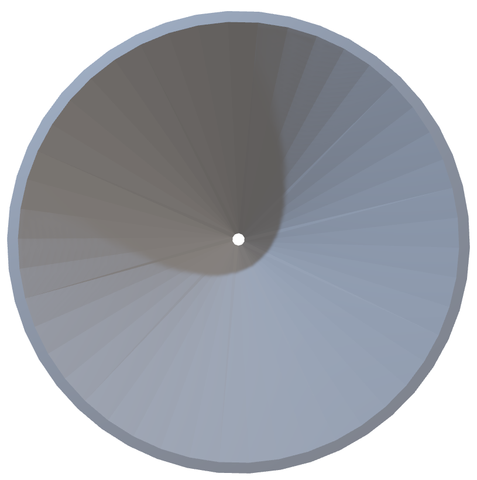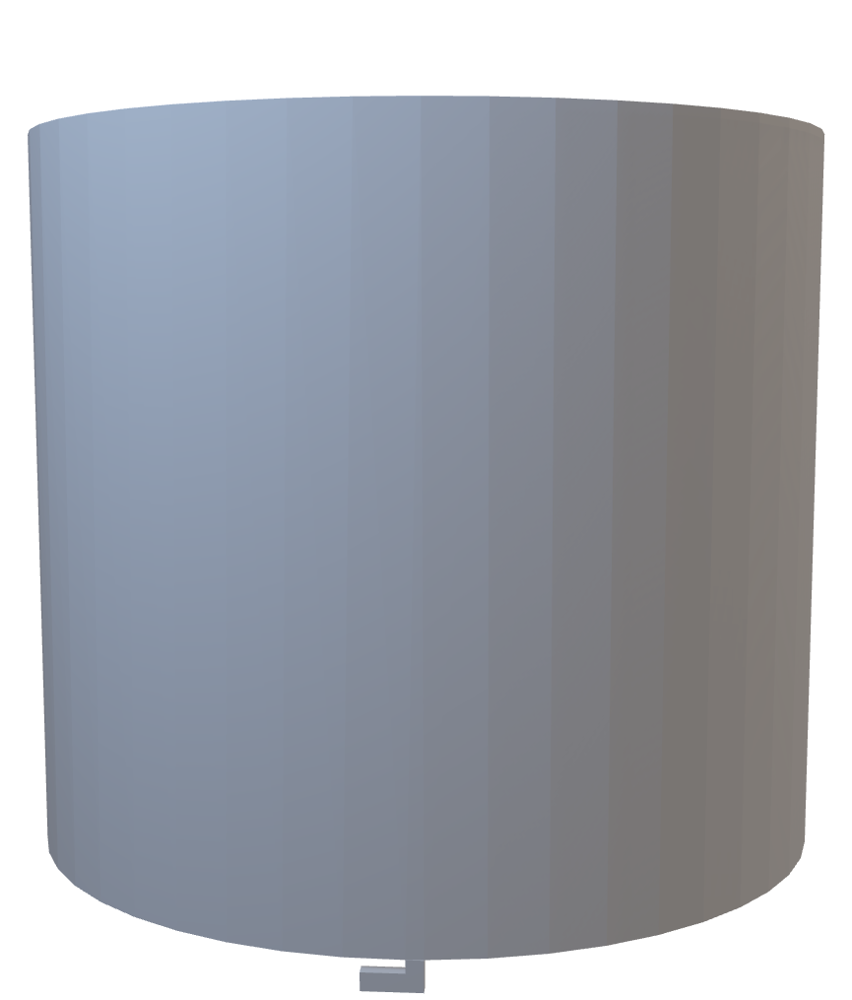

The second part, Figure 56, represents the base of the product. An external groove welcomes the funnel. Two rainwater drain holes as well as holes for fixing the bucket. Also, some holes are present in the groove to enable rainwater to escape.

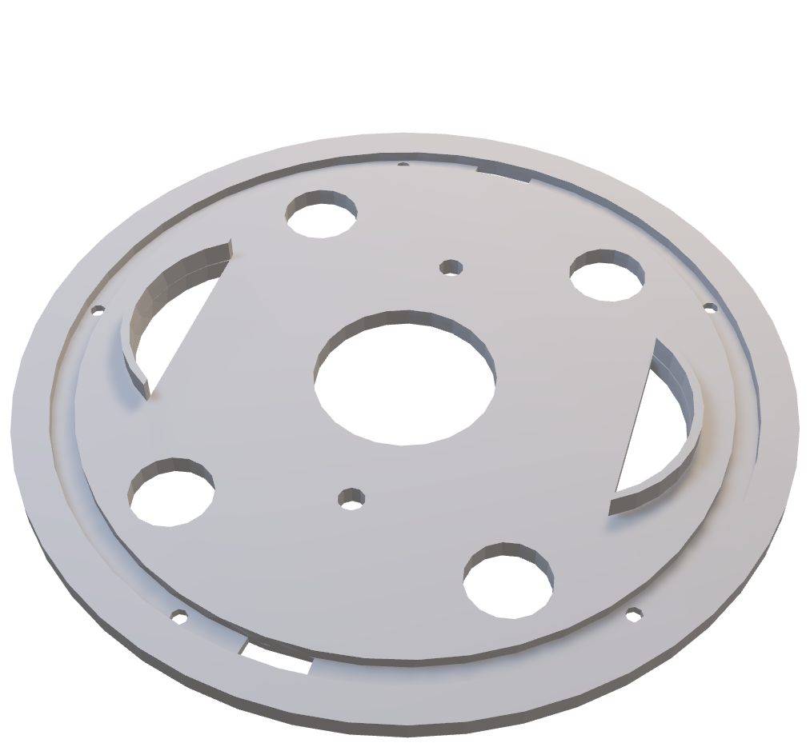

Figure 56 Rain collector base

In order to attach everything to the pole, the use of a square, Figure 57, seemed to be the easiest solution to 3D print. It is aimed at the wooden pole and then the base is fixed with screws.

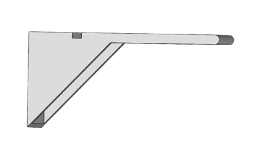

Figure 57 Rain collector square

Figure 58 is the bucket with its support. The support just allows the spoon to have a support to rotate and position the reed switch to retrieve the data.

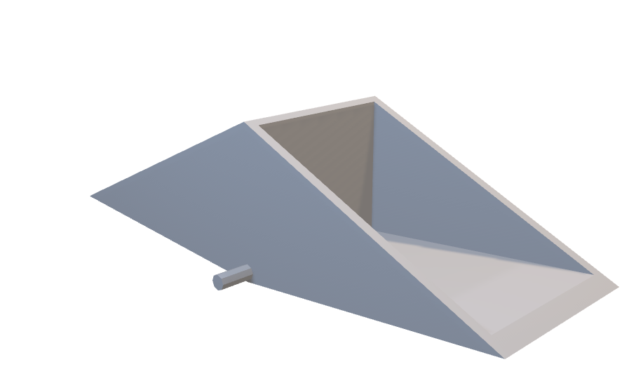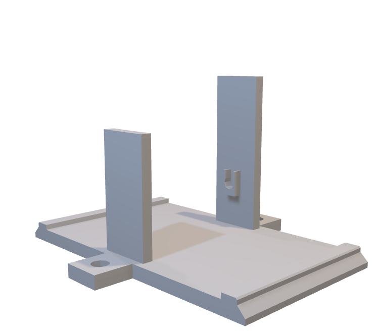

Figure 58 Rain collector spoon and support

The choice of using a two-sided spoon is justified by two facts: For a one-sided spoon when tilting the time, it goes up a quantity of rain is lost, and the second in order to avoid calculating the necessary counterweight to calculate an exact amount of rain.

Figure 59 gives a view on the inside and of the outside of the full assembled rain sensor.

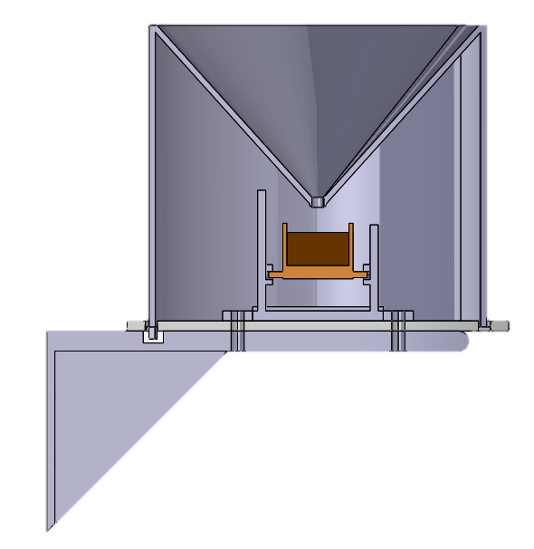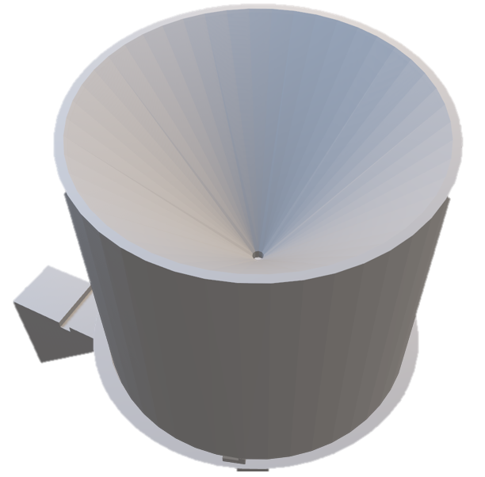

Figure 59 Inside and outside part of the whole rain sensor

##### Sizing

First, a recall is made on how precipitation is measured. Knowing the rate of precipitation makes it possible to know the amount of water that is absorbed by the soil, which makes it possible to fill the water tables and to compare each year the rate of precipitation each. They are measured in millimetres. 1mm of rain represents 1L of water per square meter. It is not possible to measure the height over 1 square meter, because of its report on the independent surface of a rain gauge. It was necessary to size the bucket. A physical law is used of a volume of liquid referenced to a surface one obtains the height of this liquid.

Equation 3 Velocity of the water for buckets through a small hole

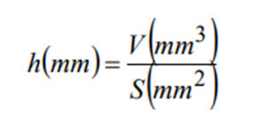

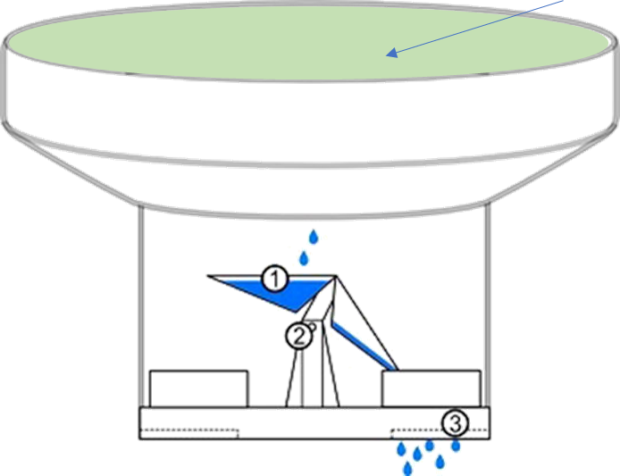

Figure 60 Rain collector diagram

For a surface area of 20,000mm square of the cone, Figure 60, the spoon must be tipped for a quantity of water of 8000 mm3. This equals 3mm. 1mm³ represents 1 ml of water and is equivalent to 1 gram.

Once the quantity at which the spoon is to be tipped is found it is necessary to dimension the size of the spoon. It must be able to accommodate the necessary volume of water and swing for a mass of 8 grams. Once the quantity at which the spoon is to be tipped is found it is necessary to size the size of the spoon. It must be able to accommodate the necessary volume of water and swing for a mass of 8 grams.

In Figure 61 a representative diagram of the force distribution can be seen.

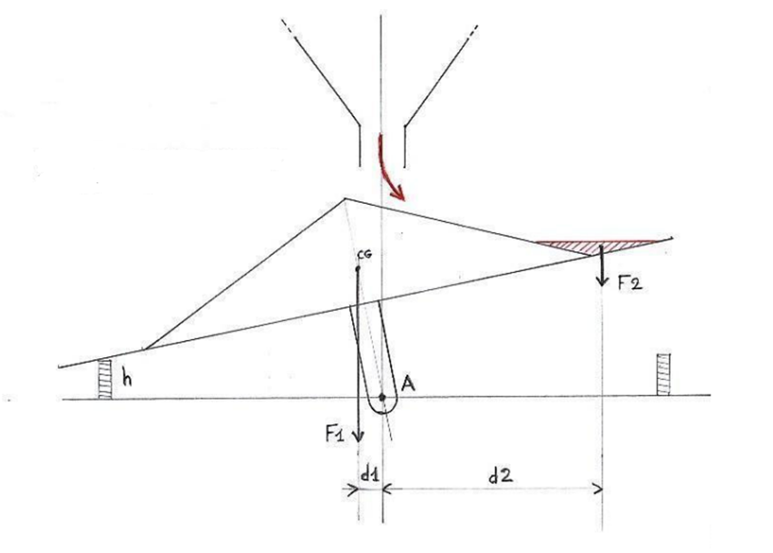

Figure 61 Force distribution on the spoon

This is the principle of a stable/unstable toppling, that is to say, whose centre of gravity (CG) is clearly above the axis of rotation (A). If the scale was in balance (indifferent or stable), the rainwater (in red) would drain as the scale tilts.

When the troughs are empty: The weight of the scale (F1) applied to its centre of gravity (CG) keeps the scale in a stable position.

When a trough fills, the centre of gravity (CG) moves to the side where the trough fills. When the centre of gravity passes beyond the vertical passing through (A), the tipping is complete and the trough empties.

The toppling condition is: **F2 × d2 \> F1 × d1**

Friction forces are not measured.

Data:

\-d1 = 0,01m -CG= 0,016kg

\-d2= 0,025m -Magnet = 0,0035kg

\-g= 9,81 m/s² -rainwater= 0,008kg

M2\>M1 --\> **F2 × d2 \> F1 × d1**

##### Sensor

In order to recover precipitation data, the same system used in the Davis sensor a magnetic switch is used.

Two individual wire contacts, known as the reeds, are housed in a hermetically sealed glass bubble or envelope. These serve as the switch contacts. This bubble is often filled with an inert gas like nitrogen to help prevent particle build-up causing performance issues over time.

The switch reeds are ferromagnetic, meaning they are made from an iron-based metal that will respond quickly and easily to magnetic forces. This is typically an alloy of nickel and iron - usually 52% nickel. They will often be coated with an additional layer of tougher metal too, for longer working life. For some types of reed switches, only one of the wires is ferromagnetic, and the other will not move. Both reeds are blade-like and designed with a flattened and widened contact area. This offers greater reliability than single-point contacts.

When a magnetic field is brought close enough to the outer casing of the reed switch, the contacts inside are pushed together or apart. This makes or breaks the circuit, depending on the direction of movement. In a normally open reed switch - the most common type - the two contact blades are positioned slightly apart, with an air gap between them. This leaves the circuit they are attached to incomplete until a magnetic force is introduced.

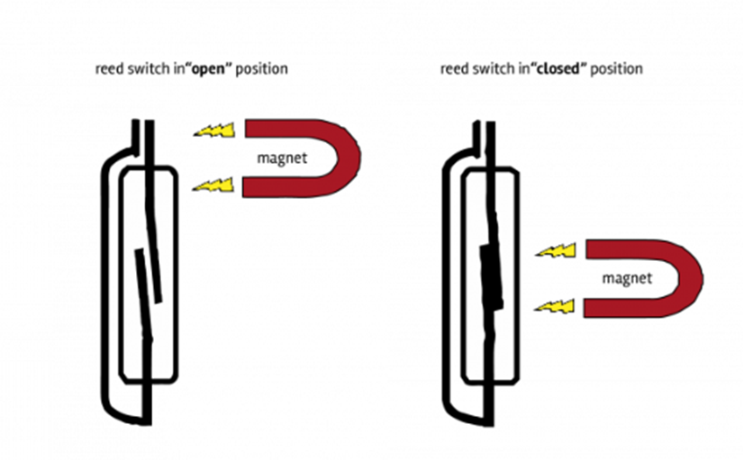

Figure 62 Magnetic switch draw

In the sensor, Figure 62, a magnet is placed on the side of the bucket and at each tip of the spoon the magnet passes in front of the reed switch and closes the switch which transmits a pulse towards the Arduino. More information about the switch can be found in B. Appendices and 4.2.2.2.3 Rain.

### 4.3.6 Solar power

#### 4.3.6.1 Analyze

Solar power is chosen, because it is the easiest way to power an Arduino on a weather station. Wind power would also be a good option, but that would be a lot more work, so solar power is chosen. The solar panel needs to be almost vertical (10 degree), because the sun in Finland is almost on the horizon in the winter. By placing it this way it insures there is solar power all year and not only in the summer. In the summer the power wouldn’t be optimal, but there is way more sun anyway, so it’s not so bad.

#### 4.3.6.2 Final design

##### Design

The solar panel is mounted on a special designed mount for the solar panel. This creates a good mount and the 10-degree angle. The solar panel delivers 5V and 10W, which should be more than enough for the Arduino. This power is delivered to a power manager and after that the batteries. The batteries hold 56.000 Mah, which is a bit of an overkill, but it ensures that there is always enough power for the Arduino even without sunlight for a couple of days. The parts, Figure 63, are printed with 310gr of PETG, which is about €12,40.

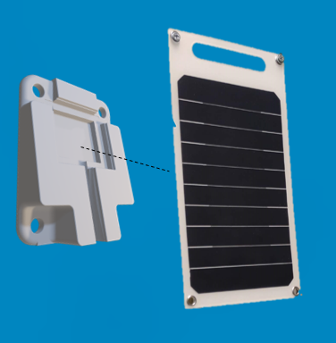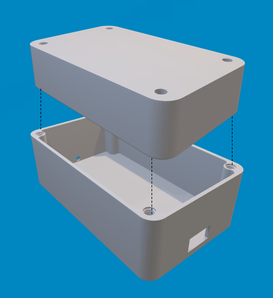

Figure 63 Housing of the solar panel and its cables

##### How it works

In Figure 64 it shows how the energy flow works. Sunlight will fixate on the panel, which powers the batteries through the Arduino.

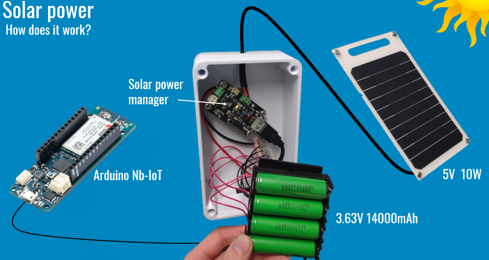

Figure 64 Information about the working of the solar panel

## General coding

### Concept phase

#### Battery

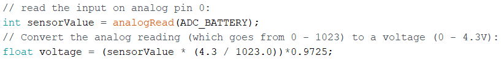

#### Setup

1.  Start Serial port:

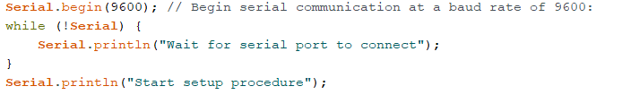

1.  Set date and time for the Arduino:

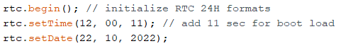

1.  Connect to Internet:

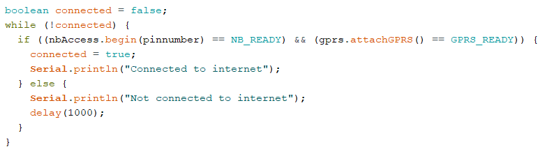

1.  Connect to MQTT:

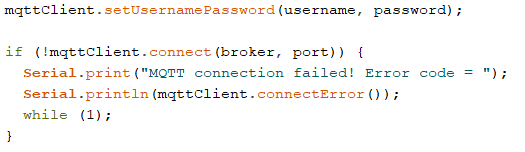

### Final phase

#### *4.4.2.1 Library’s*

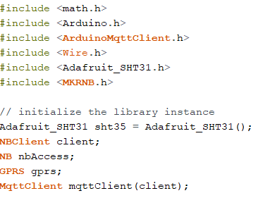

#### *4.4.2.2 Variable*

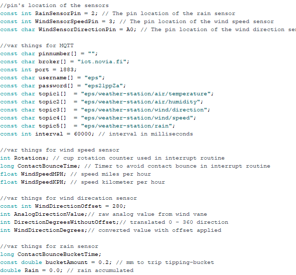

*  
*

#### *4.4.2.3 Setup*

1.  Check if serial port is connected:

    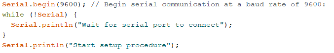

2.  Check if temperature sensor is connected:

    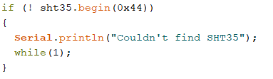

3.  Set pin mode and Interrupt

    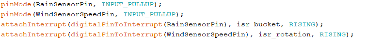

4.  Starting the modem and setting

    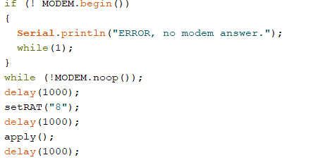

1.  Set Radio Access Technology

    Options are:  
    “7” - CAT M1 only

    “8” - NB IoT only

    “7,8” - CAT M1 preferred, NB IoT as failover (default)

    "8,7" - NB IoT preferred, CAT M1 as failover

    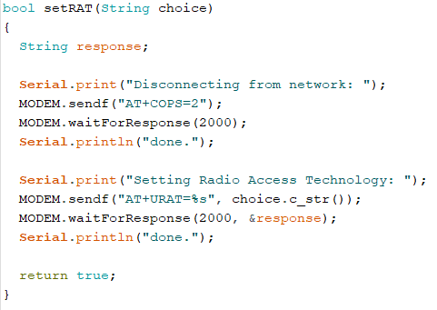

2.  Apply the new settings  
    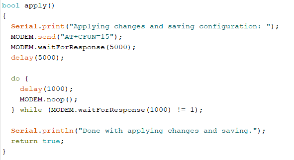
3.  Connecting to cellular network  
    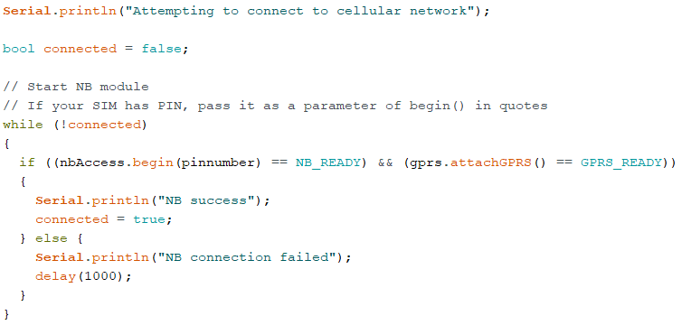
4.  Connecting to MQTT broker  
    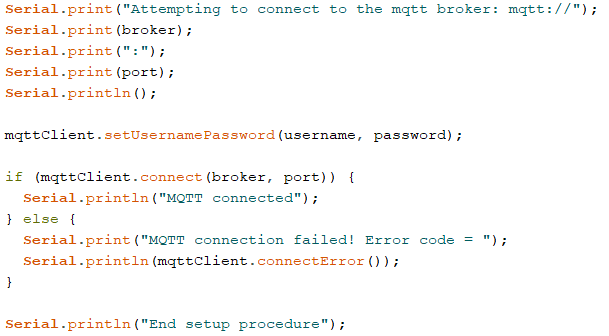

#### *4.4.2.4 Sending MQTT messages*

#### *4.4.2.5 Battery*

The battery has no code in the final phase because it now handheld automatically by the Solar Power Manager.

## Comparing V1 vs V2

In this chapter a closer look will be given on both designs of weather station made. A comparison in price and design will be made.

### 5.1.1 Design and accuracy

The first version is made with the professional sensors and the second version is made by self-made sensors, Figure 65. There is a solar panel added to the weather station. The cable problem is solved as well. Both the weather stations are similar in measurements. The temperature sensor works even better.

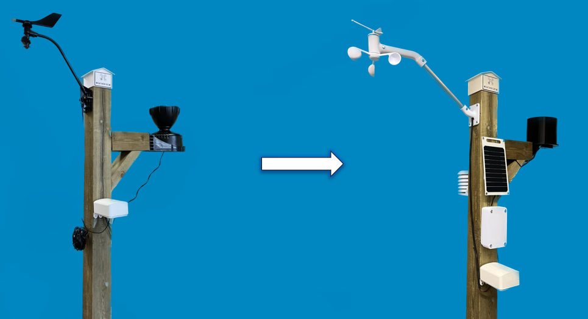

Figure 65 Picture of the first and second version of the weather station next to each other

### 5.1.2 Price

Table 11 shows the estimated price of each sensor of both versions. The price of the mounting station is less important for the comparison, because the mounting station has stayed the same. The total amount for V1 is €310,50 and for V2 it is €122,70. It can be said that the cost for version 2 has lowered a lot with the extra addition of the solar power.

Table 11 Price difference of the different versions

| Component V1                 | Price | Component V2                     | Price   | Information                                               |
|------------------------------|-------|----------------------------------|---------|-----------------------------------------------------------|
| Rain sensor                  | €120  | **Rain sensor**                  | €28     | Big savings                                               |
| Anemometer                   | €185  | **Anemometer**                   | €49     | Big savings                                               |
| Temperature/ humidity sensor | €5,50 | **Temperature/ humidity sensor** | €20,70  | The V2 sensor is more expensive, but it’s better as well. |
|                              |       | **Solar power**                  | €25     | Cheap solution                                            |

# Discussion

During this project, not everything that was initially intended to be implemented has been added. This may be justified by a few factors.

First, the 3D printer was often used or reserved, which leaded to procrastination of printing the parts. This meant less prototypes could be made as well, which leaded to trying less options or designs. The rain collector eventually could not be printed in PETG, due to lack of time. In addition, the high tolerance of 3D printing, which means the dimensions put in the machine have some deviation from reality, creates defects on parts. Adjusting the accuracy of the printing imposes a very long impression.

Secondly, using the cheapest material is not always the best solution. They are very fragile due to their price, which creates breakage. As a conclusion it may be sometimes better and cheaper to single purchase a part of a more acceptable quality, then to print it several times, because it wastes a lot of material and it is a loss of money.

Furthermore, due to some holidays, trips and free time the weather station was not put outside. Next time, it could have lots of benefits to put it outside for a while and compare some data to test the accuracy.

Found is also that the idea of using the IoT system to communicate data is good, but very complicated when the skills are not there to do it. Not having a model or other examples on the internet to understand how it works, makes it quite hard. Due to this, many hours have been spent and wasted on these tasks. For another time it may be better to put it away faster.

Lastly, after changing the leader within the group, the planning was a little bit neglected due to communication problems. At the end there was a bit of stressfulness again and a lot needed to be done. It leaded to lack of time. Next time, the team members should intervene a little bit earlier and communicate a bit better.

Afterall, the European Project Semester was not only intended to finish a project. It also consisted of some trips and other school subjects, which already meant it was not possible to work full time on the project and eventually leaded to a lack of time within the group. The project was to learn about other subjects than the ones that each team member is familiar with and to work together with people from completely differently cultures. This all worked like a charm. For example, every discussion within the group, was solved in an adult and respectful way. Moreover, the team had a clear schedule on when to meet and met regularly. In addition to weekly meetings, a good workflow was created. Also, since the group met so many times per week, it was always clear for everyone what to do and how to do it. If the last point was not the case, there was always another team member available to help out.

# Conclusion

The goal of the project was to build a low-cost IoT weather station at Novia UAS that is solar powered and has wireless data transfer to MQTT broker. Besides that, minimal power should be consumed. Firstly, a working system, prototype, should be made using commercial sensors. The network LTE-M can be used first, but later NB-IoT will be used for more energy efficiency. Furthermore, low-cost sensors should be assessed and with the help of additive manufacturing other sensors the overall cost should be lowered. The code must be made modular so that additional sensors can easily be added and is easy to use.

The weather station build within the project can measure the next weather conditions: temperature, humidity, wind speed, wind direction and rain fall. Use is made of a solar panel. This means that besides the batteries the weather station is solar powered. It has wireless data transfer to the MQTT broker, but NB-IoT could not be implemented. The sensors and the design where made a low-cost as possible, which resulted is saving around €200, seen in 5 Comparing V1 vs V2, but some improvements can still be made. The code is made easier, which helps the fact additional sensors can be added.

As it can be concluded, the project did not meet all the objectives set beforehand, but the result mostly tipped our expectations, even tough the product is not finished. The product is still usable for another team to do some upgraded and to add sensors. A few examples of sensors not yet used are the light sensor and snow depth sensor.

## 7.1 Time spend on the project

The members of team registered their time spent in the project. The total estimated time of the whole group is around 1010 hours. The total estimated time of each member individually are displayed below in Table 12.

Table 12 Time worked on the project

| Name    | Time (hours) |
|---------|--------------|
| Antonin | 245          |
| Bryan   | 260          |
| Chantal | 245          |
| Job     | 260          |

# Recommendations

There are lots of recommendations that can be done for the sequel of the project. Some points can be improved.

-   Re-printing parts with the help of additive manufacturing for better tolerance fitting

    For example, some of the parts are printed in PLA and can be swapped with PETG versions of the design. The wind direction sensor is workable, but it is quite small. Research can be done on the optimal size.

-   Leaf protection rainfall sensor

    When rain is falling and the rain sensor is put underneath a tree, lots of leaves will fall on the sensor, which can block the way for the waterflow. A look can be given on the best way to avoid this problem, like putting a grid on top of it.

-   Low power improvement

    If more NB-IoT documentation will be published, more research can be done on low power improvement. This may enable the weather station to work for longer periods.

-   Add ‘Omniá’ snow depth sensor

    The snow depth and maybe a lightning catcher can be added to complete measurability of the weather station.

-   Add self-made PCB

    The assemblance of the sensors within this project has been done with cables, which takes lots of space. A PCB should be made to improve the use of the sensors and to make it easier to use.

With these improvements and recommendations, the weather station can be made more optimal.

# A. References

Agrawal, S. (2022, Januari 21). *ESP32 Based IoT Weather Station \| How To Make \| Complete Guide*. Retrieved from YouTube: https://www.youtube.com/watch?v=GE5an3kYOKQ

Alex. (2022, September 13). *A.1 — Static and dynamic libraries*. Retrieved from Learn CPP: https://www.learncpp.com/cpp-tutorial/a1-static-and-dynamic-libraries/

Barnatt, C. (2021, Januari 3). *Raspberry Pi Weather Station*. Retrieved from YouTube: https://www.youtube.com/watch?v=ChQpD2gsC20

Barrett, A. (2020, June 9). *Advantages and Disadvantages of PLA*. Retrieved from Bioplastics News: https://bioplasticsnews.com/2020/06/09/polylactic-acid-pla-dis-advantages/

Belbin. (2022). *The Nine Belbin Team Roles*. Retrieved from Belbin: https://www.belbin.com/about/belbin-team-roles

European Project Semester. (2022). *Concept*. Retrieved from European Project Semester: http://europeanprojectsemester.eu/concept

Finn, K. (2017, April 24). *How to Calculate Center of Mass*. Retrieved from Sciencing: https://sciencing.com/calculate-center-mass-5217613.html

Flynt, J. (2020, July 22). *The Pros and Cons of Every 3D Printing Filament Material*. Retrieved from 3D insider: https://3dinsider.com/pros-and-cons-3d-printing-filaments/

Grabcad Community. (2022). *Solidworks*. Retrieved from Gradcad Community: https://grabcad.com/library/software/solidworks

Hall, N. (2022, October 27). *Newton’s Laws of Motion*. Retrieved from NASA Glenn Research Center: https://www1.grc.nasa.gov/beginners-guide-to-aeronautics/newtons-laws-of-motion/\#:\~:text=His%20second%20law%20defines%20a,object%20times%20its%20velocity%20V.

Hartman. (2022). *Betonilaatta harmaa BL305 300x300x50 tarjous Lakka.* Retrieved from Hartman: https://www.hartman.fi/fi/betonilaatta-harmaa-bl305-300x300x50-tarjous-lakka-kr02?gclid=Cj0KCQjwj7CZBhDHARIsAPPWv3ezUTzVccKy35KUTbjR8f5y_9uRqlw5pviCyN9SpccEt-AByBZYMAUaAoaBEALw_wcB

Hugo Kerhascoët, J. L. (2016, April). *Methodology for optimal wind vane design.* Retrieved from ResearchGate: 10.1109/OCEANSAP.2016.7485426

K-Rauta. (2022). *K-Rauta*. Retrieved from Parru PROF solid wood green 100x100 NTR/A: https://www.k-rauta.fi/tuote/parru-prof-kestopuu-vihrea-100x100-ntra/6438313639404

K-Rauta. (2022). *Post leg PROF hot-dip galvanized 102x102mm*. Retrieved from K-Rauta: https://www.k-rauta.fi/tuote/tolpanjalka-prof-kuumasinkitty-102x102mm/6438313550020

Laird Plastics. (2022, februari 3). *What Is PETG (Polyethylene Terephthalate Glycol)*. Retrieved from Laird Plastics.

Lavri, O. (2022, June 21). *Tools and practices to improve your leadership competencies*. Retrieved from HR Forecast: https://hrforecast.com/leadership-skills-assessment-tests-surveys-and-other-tools/

Metergroup. (2020). *Atmos 41 All-in-one weather station*. Retrieved from Metergroup: https://www.metergroup.com/en/meter-environment/products/atmos-41-weather-station?creative=573262785499&keyword=weatherstation&matchtype=p&network=g&device=c&gclid=EAIaIQobChMIqPyok46U-gIV-wIGAB3V-Q1NEAAYASAAEgIgf_D_BwE

Open Green Energy. (2021, March 29). *DIY Solar Powered WiFi Weather Station V3.0 \|\| Monitoring Wind and Rainfall*. Retrieved from YouTube: https://www.youtube.com/watch?v=GxlG2v3BF20

Sammarco, M. (2019, February 17). *Wind Vane Analysis & Design*. Retrieved from ISSUU: https://issuu.com/matteosammarco/docs/wind_vane_analysis___design

SECTRON. (2020, December 1). *GM-SC-MS - SECTRON weather station*. Retrieved from SECTRON: https://eshop.sectron.eu/en/sectron-weather-station-with-wifi-lan-converter/p-15155/

Smith, L. W. (2000, september 7). *Stakeholder analysis: a pivotal practice of successful projects.* Retrieved from Project Management Institute: https://www.pmi.org/learning/library/stakeholder-analysis-pivotal-practice-projects-8905\#:\~:text=A%20formal%20definition%20of%20a,PMI%C2%AE)%2C%201996).

SparkFun Electronics. (2022, mei 3). *SEN-15901 - Weather Meter Kit*. Retrieved from www.sparkfun.com: https://www.sparkfun.com/products/15901

Swain, R. (2021, December). *3 tips for succesfull group work*. Retrieved from Prospects: https://www.prospects.ac.uk/applying-for-university/university-life/3-tips-for-successful-group-work

Weatherspares. (2021, juni 22). *Ecowitt GW1102 with WiFi Gateway & 3 Outdoor Sensors*. Retrieved from Weatherspares: https://weatherspares.co.uk/products/ecowitt-gw1102-wi-fi-gateway-with-solar-anemometer-uv-light-sensor-rain-gauge?variant=41449301082275&currency=GBP&utm_medium=product_sync&utm_source=google&utm_content=sag_organic&utm_campaign=sag_organic&utm_campaign=

Winberg, U. (2015, Januari 4). *Low Cost Weather Station*. Retrieved from Hackaday: https://hackaday.io/project/5068-low-cost-weather-station

WorkBreakdownStructure. (2022). *What is a Work Breakdown Structure?* Retrieved from WorkBreakdownStructure.com: https://www.workbreakdownstructure.com/

# B. Appendices

This chapter consist of extra information needed for the project, such as figures, tables, maps, raw data and computer programs.

## B.1 DIY weather stations

Some of the DIY weather stations not mentioned are giving below in Table 13.

Table 13 DIY YouTube videos given with some information

| Builder          | Title                                                               | Date             | Link                                          |
|------------------|---------------------------------------------------------------------|------------------|-----------------------------------------------|
| Micheal klements | I Upgraded My 3D Printed IoT Weather Station Using Your Suggestions | October 27, 2021 | <https://www.youtube.com/watch?v=xVK4bF5U2Xk> |
| Modest maker     | Argent Weather Station Arduino Hacks - Hardware and Code            | January 8, 2020  | <https://www.youtube.com/watch?v=KHrTqdmYoAk> |
| Hans Schmitz     | Advanced At-Home Weather Station                                    | August 12, 2016  | <https://www.youtube.com/watch?v=nG7bF15tK-Y> |

## B.2 Material choice

Table 14 Materials and their properties

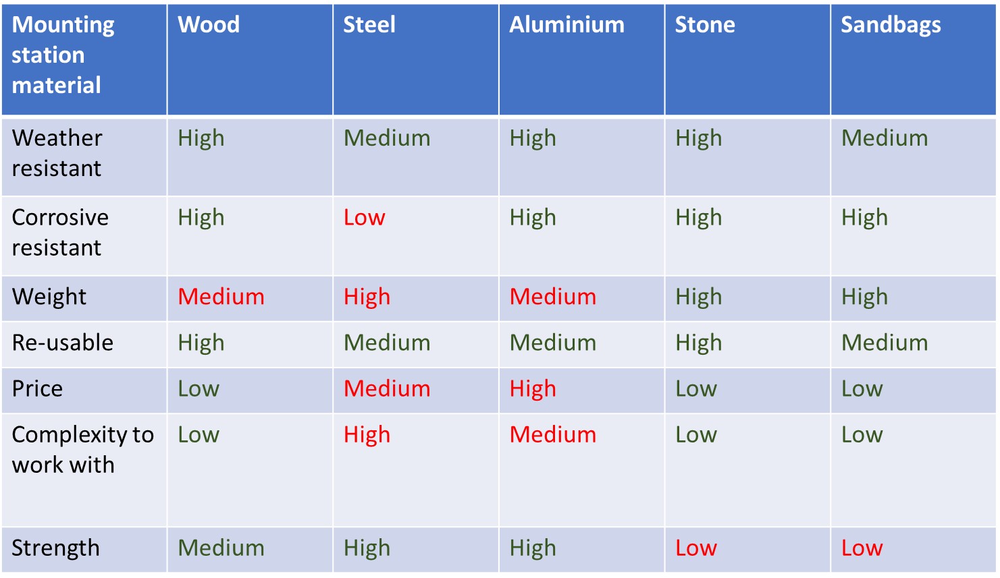

## B.3 Calculations

### B.3.1 Calculations for the wind direction Design

Table 15 Displacements and force of each part

| **Point (name)** |   |   |   |
|------------------|---|---|---|
|                  |   |   |   |
|                  |   |   |   |
|                  |   |   |   |
|                  |   |   |   |
|                  |   |   |   |

The full equation, Equation 1, is . The design without the metal to balance the vane the centre of mass can be found at . The chosen center of mass is at , therefore the centre of mass should shift.

Shifting the centre of mass means it is more convenient to use Equation 2, which uses the centre of mass as reference point, therefore has different x-values, and provides the force of the metal that needs to be used. The full equation is . The force is calculated with , whereas . . On that account the mass can be found with .

## B.4 Specifications

### B.4.1 Magnetic switch

Table 16 Specifications of the magnetic switch

| Type of sensor     | **reed switch** |
|--------------------|-----------------|
| Measuring range    | **5 to 15AT**   |
| Switching capacity | **5W**          |
| Body dimensions    | **Ø1.8x5mm**    |
| Switched current   | **350mA**       |
| Switched voltage   | **max. 200V**   |

### B.4.2 Rotating hall-sensor

Table 17 Specification of the rotating hall-sensor

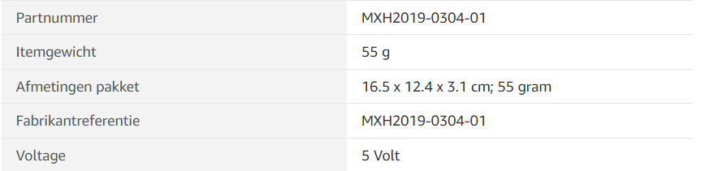
